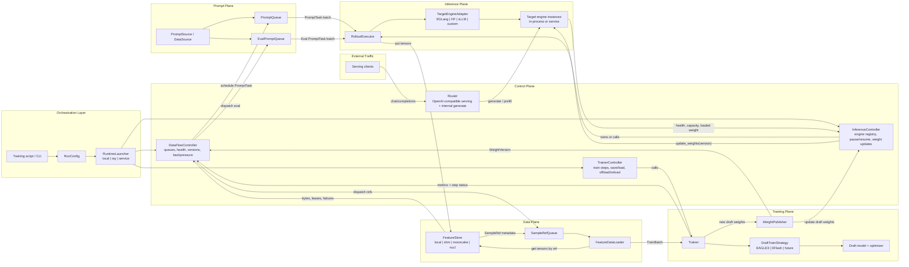
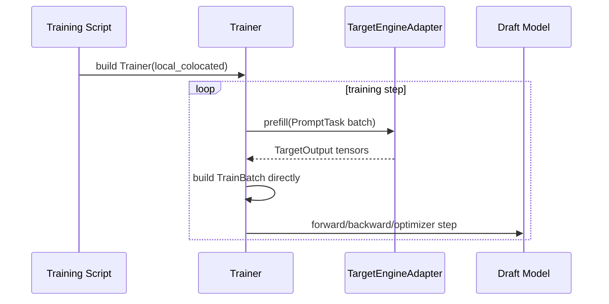
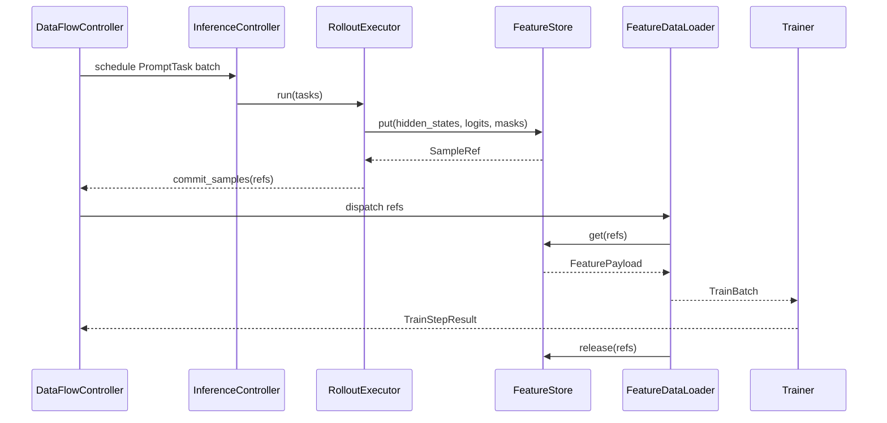
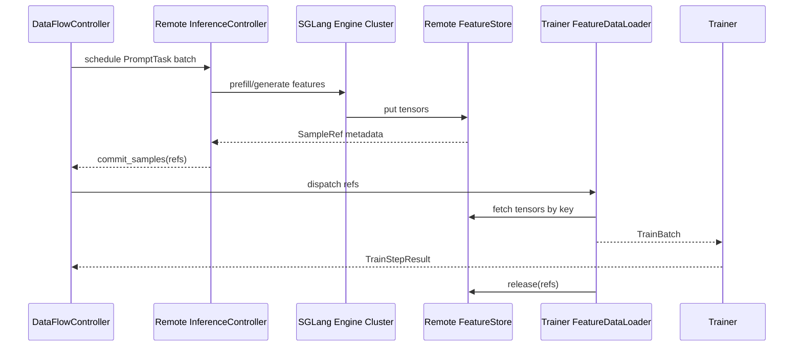
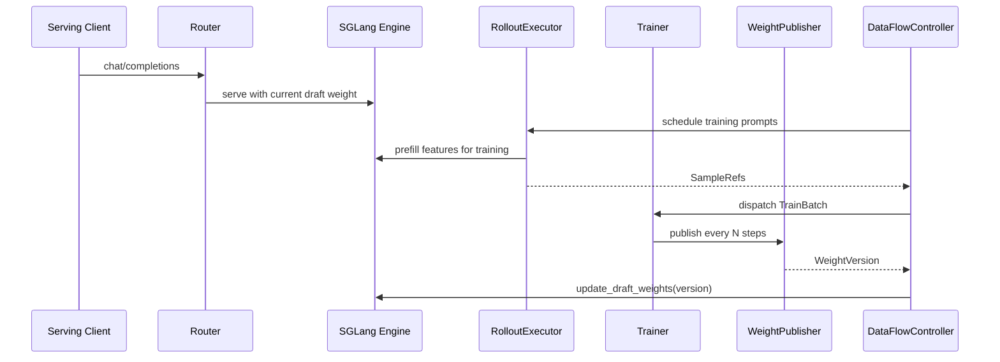

# SpecForge DataFlow Refactor Workflow

> Status: draft design note
>
> Purpose: define the runtime mental model, component boundaries, and API
> contracts for the dataflow-centered online training refactor.

Draw.io source: [dataflow_refactor_workflow.drawio](dataflow_refactor_workflow.drawio)

## 1. Design stance

The refactor should separate three concerns that are currently easy to mix
together:

1. **Orchestration**: starts the run, chooses the runtime profile, creates
   components, and wires them together.
2. **Control plane**: owns queues, routing, health, worker registry,
   backpressure, and version policy.
3. **Data plane**: owns large tensors such as hidden states, target logits,
   input ids, masks, and media tensors.

Control-plane APIs should move metadata only. Large tensors should either stay
in process for the default local path, or move through a `FeatureStore` backend
for dataflow colocated and disaggregated paths.

The important abstraction is **not Ray** and not **Mooncake**. The important
abstraction is:

```text
PromptTask -> RolloutExecutor -> SampleRef -> FeatureDataLoader -> TrainBatch -> Trainer
```

Ray, HTTP, NCCL, shared memory, and Mooncake are runtime or transport choices
behind those contracts.

## 2. Runtime profiles

SpecForge should support three profiles with the same high-level contracts.

| Profile | Process/resource shape | Data movement | Default use case |
|---|---|---|---|
| `local_colocated` | Trainer owns the target forward in the same torchrun job | Direct `TrainBatch`, optionally using `LocalFeatureStore` internally | Simple single-cluster online training. This should remain the default. |
| `dataflow_colocated` | Trainer and inference workers are separate components but colocated on the same GPU allocation | Metadata queues plus local/shared-memory/Mooncake TCP backend | Need overlap, scheduling, eval cache, or multiple rollout sources without separate inference GPUs. |
| `disaggregated` | Trainer and inference engine run on independent GPU pools | Metadata queues plus Mooncake/RDMA, NCCL, or another remote `FeatureStore` backend | Large target model, multi-node target TP, serving traffic, or independent train/inference scaling. |

The profiles differ in deployment, not in the logical workflow. This lets us
start from the lightweight path and grow into production dataflow without
rewriting the trainer.

## 3. Mental model



## 4. Component boundaries

### 4.1 Orchestration script

Responsibility:
- Parse config and choose the runtime profile.
- Build component factories.
- Start components in local, Ray, or service mode.
- Wire controller endpoints together.

Does not own:
- Tensor storage.
- Training policy.
- Inference scheduling policy after startup.

Primary input:
- `RunConfig`

Primary output:
- Running component graph and top-level exit status.

### 4.2 DataFlowController

Responsibility:
- Own global queue state and scheduling.
- Track worker readiness and health.
- Track `SampleRef` lifecycle: pending, dispatched, consumed, released, failed.
- Enforce backpressure by sample count and estimated tensor bytes.
- Track target and draft weight versions.
- Decide whether stale samples are trainable, replayable, or dropped.

Does not own:
- Large tensors.
- Model objects.
- HTTP serving semantics.

Primary APIs:
- `register_rollout_worker(worker_info) -> WorkerId`
- `register_trainer_worker(worker_info) -> WorkerId`
- `enqueue_prompts(tasks: list[PromptTask]) -> list[PromptId]`
- `dispatch_rollout(max_tasks: int) -> list[PromptTask]`
- `commit_samples(refs: list[SampleRef]) -> None`
- `dispatch_train_batch(policy: DispatchPolicy) -> list[SampleRef]`
- `ack_train_samples(refs: list[SampleRef]) -> None`
- `fail_samples(refs: list[SampleRef], reason: str) -> None`
- `get_status() -> ControllerStatus`

### 4.3 InferenceController

Responsibility:
- Own rollout engine registry.
- Pause/resume inference workers.
- Forward weight updates to engines.
- Expose engine capacity and health.
- Support both internal data generation and optional serving traffic.

Does not own:
- Draft optimizer state.
- Training steps.
- Long-lived sample queues.

Primary APIs:
- `register_engine(engine: EngineInfo) -> EngineId`
- `generate_features(tasks: list[PromptTask], policy: RolloutPolicy) -> list[SampleRef]`
- `pause(reason: str) -> None`
- `resume() -> None`
- `update_weights(version: WeightVersion) -> None`
- `get_engine_status() -> list[EngineStatus]`

Service endpoints, when deployed as a service:
- `POST /internal/generate_features`
- `POST /internal/pause`
- `POST /internal/resume`
- `POST /internal/weights/update`
- `GET /internal/status`

### 4.4 RolloutExecutor

Responsibility:
- Convert prompt tasks into target-model features.
- Call the selected target adapter.
- Write large tensors into `FeatureStore`.
- Return `SampleRef` metadata.

Does not own:
- Training batches.
- Optimizer state.
- Cross-run queue durability.

Primary APIs:
- `run(tasks: list[PromptTask], feature_spec: FeatureSpec) -> list[SampleRef]`
- `eval(tasks: list[PromptTask], feature_spec: FeatureSpec) -> list[SampleRef]`
- `shutdown() -> None`

### 4.5 TargetEngineAdapter

Responsibility:
- Hide target backend differences.
- Normalize output layout for the trainer contract.
- Support target TP and optional media inputs.
- Optionally update draft weights for train-with-decode.

Does not own:
- Prompt queueing.
- Feature retention.
- Backpressure policy.

Primary APIs:
- `prefill(tasks: list[PromptTask], feature_spec: FeatureSpec) -> TargetOutput`
- `generate(requests: list[GenerateRequest]) -> list[GenerateOutput]`
- `update_draft_weights(version: WeightVersion) -> None`
- `get_status() -> EngineStatus`

### 4.6 FeatureStore

Responsibility:
- Own large tensors and their lifecycle.
- Store tensors by key and expose metadata needed to reconstruct them.
- Implement release, abort, stats, and failure behavior.
- Hide local memory, shared memory, Mooncake, NCCL, or file-backed transport.

Does not own:
- Scheduling.
- Model inference.
- Training semantics.

Primary APIs:
- `put(features: FeaturePayload, metadata: FeatureMetadata) -> SampleRef`
- `get(refs: list[SampleRef], device: DeviceSpec) -> list[FeaturePayload]`
- `release(refs: list[SampleRef]) -> None`
- `abort(refs: list[SampleRef], reason: str) -> None`
- `stat() -> FeatureStoreStats`

Required lifecycle states:
- `created`
- `available`
- `leased`
- `released`
- `failed`

### 4.7 FeatureDataLoader

Responsibility:
- Consume `SampleRef` objects.
- Fetch feature tensors from `FeatureStore`.
- Validate shape, dtype, version, and layout.
- Collate and pad tensors into `TrainBatch`.
- Release refs after trainer acknowledgement.

Does not own:
- Target inference.
- Optimizer step.
- Global scheduling.

Primary APIs:
- `next_batch(batch_spec: BatchSpec) -> TrainBatch`
- `ack(batch: TrainBatch) -> None`
- `fail(batch: TrainBatch, reason: str) -> None`

### 4.8 TrainerController

Responsibility:
- Own trainer lifecycle.
- Trigger training steps.
- Save/load checkpoints.
- Offload/onload weights for colocated memory pressure.
- Publish draft weight versions.

Does not own:
- Target engine instances.
- Prompt queueing.
- Feature storage.

Primary APIs:
- `train_step(batch_or_refs: TrainBatch | list[SampleRef]) -> TrainStepResult`
- `save(path: str) -> CheckpointInfo`
- `load(path: str) -> CheckpointInfo`
- `offload_weights() -> None`
- `onload_weights() -> None`
- `publish_weights(policy: PublishPolicy) -> WeightVersion`
- `get_status() -> TrainerStatus`

### 4.9 Trainer

Responsibility:
- Own draft model, optimizer, scheduler, checkpoint state, and train strategy.
- Convert `TrainBatch` into loss, backward, optimizer step, and metrics.
- Keep trainer-local distributed assumptions explicit: DP, FSDP, SP, TP.

Does not own:
- Target engine details.
- FeatureStore backend details.
- Serving router.

Primary APIs:
- `step(batch: TrainBatch) -> TrainStepResult`
- `eval(batch: TrainBatch) -> EvalStepResult`
- `state_dict() -> dict`
- `load_state_dict(state: dict) -> None`

### 4.10 WeightPublisher

Responsibility:
- Export draft weights into a format loadable by serving/inference engines.
- Create immutable `WeightVersion` records.
- Push or announce new weights to `InferenceController`.

Does not own:
- Training step scheduling.
- Serving request routing.

Primary APIs:
- `publish(step: int, model_state: ModelState) -> WeightVersion`
- `cleanup(policy: RetentionPolicy) -> None`

## 5. Core data contracts

These contracts should be small enough to serialize, log, and test. Tensor
payloads stay behind `FeatureStore`.

### 5.1 PromptTask

```python
@dataclass
class PromptTask:
    task_id: str
    source: str
    input_ids: list[int] | None
    messages: list[dict] | None
    loss_mask: list[int] | None
    sampling_params: dict
    media: dict | None
    metadata: dict
    target_model_version: str | None
    draft_weight_version: str | None
```

### 5.2 FeatureMetadata

```python
@dataclass
class FeatureMetadata:
    feature_id: str
    task_id: str
    tensor_names: list[str]
    tensor_shapes: dict[str, tuple[int, ...]]
    tensor_dtypes: dict[str, str]
    layout: Literal["full", "tp_sharded", "sp_sharded"]
    layout_metadata: dict
    sequence_lengths: list[int]
    estimated_bytes: int
    target_model_version: str
    draft_weight_version: str | None
    created_at_ms: int
    ttl_ms: int | None
```

### 5.3 SampleRef

```python
@dataclass
class SampleRef:
    sample_id: str
    task_id: str
    store_uri: str
    feature_key: str
    metadata: FeatureMetadata
    state: Literal["created", "available", "leased", "released", "failed"]
```

### 5.4 TrainBatch

```python
@dataclass
class TrainBatch:
    sample_refs: list[SampleRef]
    input_ids: Tensor
    attention_mask: Tensor
    loss_mask: Tensor
    hidden_states: Tensor | dict[str, Tensor]
    target_logits: Tensor | None
    target_ids: Tensor | None
    position_ids: Tensor | None
    media: dict[str, Tensor] | None
    metadata: dict
```

### 5.5 WeightVersion

```python
@dataclass(frozen=True)
class WeightVersion:
    version: str
    step: int
    uri: str
    format: Literal["hf", "sglang", "state_dict"]
    checksum: str | None
    draft_model_config: dict
    created_at_ms: int
```

## 6. End-to-end workflows

### 6.1 Default local colocated training



Notes:
- This path can bypass `SampleRefQueue` physically, but should still be shaped
  like the same contracts in code.
- Good default for small target models and simple online draft training.
- Inference world size is bounded by the trainer world size.

### 6.2 Dataflow colocated training



Notes:
- Trainer and inference may share the same GPU allocation.
- This supports overlap and production-style scheduling without requiring a
  separate inference cluster.
- `FeatureStore` backend can be local memory, shared memory, or Mooncake TCP.

### 6.3 Disaggregated training



Notes:
- Target world size and trainer world size can be independent.
- The controller must track bytes, leases, retries, and stale versions.
- SGLang TP greater than 1 requires an explicit feature layout contract.

### 6.4 Train-with-decode



Notes:
- Serving and training-data generation may share the same engine.
- Weight update must be versioned and observable.
- Training samples should record which target and draft versions produced them.

## 7. Endpoint definition policy

Every boundary should have two definitions:

1. A Python protocol used by local and test implementations.
2. A service endpoint only when the component can run out of process.

This avoids forcing HTTP into the default path while still making distributed
deployments precise.

| Boundary | Local protocol | Service endpoint |
|---|---|---|
| Orchestrator -> Controller | `DataFlowController` object | Optional control service |
| Controller -> Inference | `InferenceController` protocol | `/internal/generate_features`, `/internal/status`, `/internal/weights/update` |
| Controller -> Trainer | `TrainerController` protocol | `/internal/train_step`, `/internal/save`, `/internal/status` |
| Rollout -> FeatureStore | `FeatureStore` protocol | Backend-specific, usually not public HTTP |
| Loader -> FeatureStore | `FeatureStore` protocol | Backend-specific, usually not public HTTP |
| Router -> Engine | `TargetEngineAdapter` protocol | OpenAI-compatible HTTP plus internal admin endpoints |

## 8. Required policies

### 8.1 Backpressure

The controller should enforce:
- Maximum pending prompt count.
- Maximum available sample count.
- Maximum estimated tensor bytes in `FeatureStore`.
- Maximum sample staleness by draft weight version and target model version.

### 8.2 Version policy

Each `SampleRef` should record:
- Target model version used to produce hidden states/logits.
- Draft weight version active during generation, if train-with-decode is enabled.
- Feature layout version.
- Data preprocessing/template version.

The trainer policy should explicitly choose:
- Train all available samples.
- Drop stale samples after weight update.
- Prioritize newer samples but allow bounded replay.

### 8.3 Failure policy

Required behavior:
- Rollout failure marks prompt tasks retryable or failed.
- FeatureStore put failure never returns a usable `SampleRef`.
- Trainer failure does not release refs until the controller decides whether to
  retry or drop.
- Missing tensors are treated as sample failure, not silent skip.
- Async transport errors must be observed before the next scheduling step.

### 8.4 Target TP greater than 1

Feature layout must be explicit. The first production-safe target should be:
- `layout = "full"` from the trainer perspective.
- Inference side may gather TP shards before `FeatureStore.put`, or loader may
  assemble shards before returning `TrainBatch`.

Later optimization can introduce:
- `layout = "tp_sharded"` with shard-aware `FeatureDataLoader`.
- Trainer-side strategies that consume sharded target features directly.

The trainer should not infer tensor layout from world size.

## 9. Mapping to existing external designs

### 9.1 PR 523 mapping

PR 523 roughly maps to:
- `RayOrchestrator` -> Orchestration layer.
- `TrainingPipeline` -> partial `DataFlowController`.
- `RolloutWorkerGroup` and `RolloutWorker` -> `RolloutExecutor`.
- `TrainWorkerGroup` and `TrainWorker` -> `TrainerController` plus `Trainer`.
- Ray object store or NCCL transfer -> transport backend.

The missing part is a stable `FeatureStore` plus `SampleRef` contract. Without
that contract, the pipeline is batch-transfer centered and harder to extend to
Mooncake, replay, eval cache, train-with-decode, and multiple rollout sources.

### 9.2 TorchSpec mapping

TorchSpec roughly maps to:
- `AsyncTrainingController` -> `DataFlowController`.
- `AsyncInferenceManager` -> `InferenceController`.
- `SglEngine`/`HFEngine`/`VllmEngine` -> `TargetEngineAdapter` plus engine actor.
- `MooncakeDataFetcher` and stores -> `FeatureStore` plus `FeatureDataLoader`.
- `TrainerActor` -> `TrainerController` plus `Trainer`.

TorchSpec is closer to the desired production dataflow shape, but SpecForge
should keep a cheaper `local_colocated` profile so Mooncake/Ray are not required
for the common small-draft case.

## 10. Proposed code structure

```text
specforge/
  contracts/
    prompt.py          # PromptTask, PromptId
    sample.py          # SampleRef, FeatureMetadata
    batch.py           # TrainBatch, BatchSpec
    weights.py         # WeightVersion
    status.py          # component status records

  dataflow/
    controller.py      # DataFlowController
    policies.py        # backpressure, dispatch, staleness policies
    queues.py          # prompt/sample queues

  data_plane/
    feature_store.py   # FeatureStore protocol
    local_store.py
    shared_memory.py
    mooncake.py
    nccl.py
    loader.py          # FeatureDataLoader

  rollout/
    executor.py        # RolloutExecutor
    adapters/
      base.py          # TargetEngineAdapter
      hf.py
      sglang_inproc.py
      sglang_server.py
      custom.py

  training/
    controller.py      # TrainerController
    trainer.py
    strategies/
      eagle3.py
      dflash.py
    weights.py         # WeightPublisher

  runtime/
    local.py           # local_colocated and dataflow_colocated without Ray
    ray.py             # Ray actor runtime
    service.py         # HTTP service runtime

  serving/
    router.py
    endpoints.py
```

## 11. Implementation sequence

1. Add `contracts/*` dataclasses and protocol tests.
2. Extract local `TargetEngineAdapter` and `Trainer` boundaries without changing
   current behavior.
3. Add `FeatureStore` with `LocalFeatureStore` and `FeatureDataLoader`.
4. Make local online training optionally go through `SampleRef` to validate the
   dataflow path.
5. Add `dataflow_colocated` runtime with overlap and backpressure.
6. Add SGLang service adapter and remote `FeatureStore` backend.
7. Add train-with-decode weight publishing.
8. Add Ray runtime only after the contracts are stable.

## 12. Documentation checklist per component

Each component should have a short design doc before implementation:

```text
Component:
Responsibility:
Owns:
Does not own:
Inputs:
Outputs:
Local API:
Service API, if any:
State:
Failure behavior:
Metrics:
Tests:
```

This is the minimum bar for doc-oriented design. If a component cannot fill this
template, its boundary is probably still too fuzzy.
