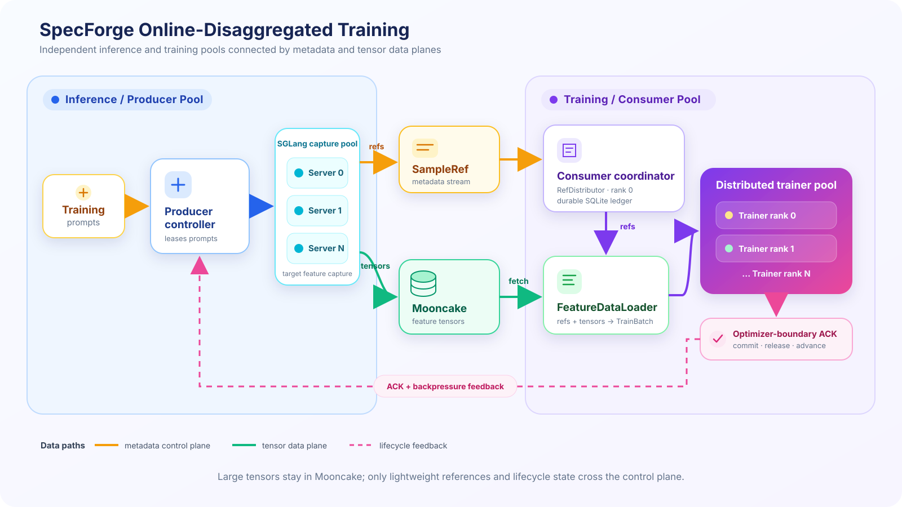
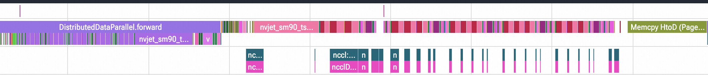
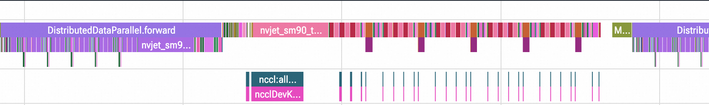

# SpecForge's New Training Runtime: Decoupling Target Inference from Draft Optimization

**The SpecForge Team · July 2026**

When we first released [SpecForge](https://www.lmsys.org/blog/2025-07-25-spec-forge/), a training job owned both the frozen target model and the draft model being optimized. This made EAGLE3 draft-model training practical and directly compatible with SGLang, but it also tied two very different workloads to the same process lifecycle and resource topology.

The new SpecForge introduces a clean boundary between **target-feature production** and **draft-model optimization**. Patched SGLang servers capture target features over the training conversations; SpecForge trainers consume those features through lightweight references backed by Mooncake.

This one architectural change has two important consequences:

- **Inference and training capacity can be configured and deployed independently.** On the same 8×H20 budget, moving Qwen3-8B Domino training to a three-server, five-trainer split improved end-to-end training throughput by approximately 10% over the previous colocated implementation.
- **Different speculative-drafting algorithms can reuse the same runtime** — the same scheduling, dataflow, distributed training, checkpointing, and failure handling. EAGLE3, EAGLE3.1, P-EAGLE, DFlash, Domino, and DSpark now share one typed configuration and one public training entry point.

This release also ships a training-serving consistency gate that verifies capture, training, export, and SGLang serving agree on a controlled example — a fast correctness check before investing in a full training run.

## From a Coupled Trainer to a Training Pipeline

Online draft-model training contains two distinct workloads:

- The **target side** runs a large, frozen model over training conversations to capture hidden states. It is inference-heavy, often uses tensor parallelism, and benefits from a production inference engine.
- The **draft side** trains a much smaller model with forward and backward passes. It scales through data or sequence parallelism and has a different memory and compute profile.

In the previous colocated design, both sides shared one lifecycle and one fixed resource layout. This created three practical limitations:

1. **A fixed inference-to-training ratio.** Scaling trainer workers also affected target-model placement, even when only one side was the bottleneck.
2. **Resource interference.** Target capture and draft optimization competed inside the same tightly coupled job.
3. **A shared failure boundary.** Slow or failed feature generation could stall training, while excess production could create unbounded memory pressure.

The key observation is simple: **trainers do not need to own the target model**. They only need the token sequences, masks, and target features required by the selected training objective. Making that boundary explicit changes SpecForge from a trainer process containing a target model into a coordinated training pipeline.

## One Boundary, Three Contracts

The new online runtime has a producer pool and a consumer pool. Producers schedule prompts across patched SGLang capture servers. SGLang writes feature tensors to Mooncake, while SpecForge sends only lightweight `SampleRef` metadata through the control plane. Trainer ranks resolve those references when they are ready to build a batch.



*Figure 1. The online-disaggregated training flow. Large tensors remain in the data plane; references and lifecycle state travel through the control plane.*

### 1. The capture contract

Every URL in `deployment.disaggregated.server_urls` creates a rollout worker connected to a patched SGLang server. Workers lease disjoint prompts from a shared controller, so capture capacity can change without changing the trainer topology.

The capture support is a small patch on top of the pinned `sglang==0.5.14`: [`patches/sglang/v0.5.14/spec-capture.patch`](https://github.com/sgl-project/SpecForge/blob/main/patches/sglang/v0.5.14/spec-capture.patch) adds an `--enable-spec-capture` flag and a server-side sink that writes captured tensors directly into Mooncake using the feature store's key layout. A capture server is a stock SGLang server with this patch applied.

This creates a clear ownership boundary: SGLang owns target-model parallelism and feature capture, while SpecForge owns prompt scheduling, reference publication, and draft-model optimization.

### 2. The delivery contract

Captured hidden states can be large, so forwarding them through a Python queue or control database would quickly become a bottleneck. SpecForge separates tensor storage from sample coordination:

- SGLang writes feature tensors to Mooncake.
- The producer publishes tensor-free `SampleRef` records.
- `FeatureDataLoader` resolves references into tensor-carrying training batches.
- Trainers release feature objects after an optimizer-step acknowledgement.

The training loop depends on the `FeatureStore` contract rather than a specific transport. The same consumer path can therefore use local features, a shared directory, or Mooncake-backed online capture.

### 3. The lifecycle contract

Distributed ranks must advance together. The consumer releases references in complete optimizer-step quanta, so every rank receives the samples it needs for one synchronized update. High and low in-flight watermarks pause and resume capture, preventing the producer from running arbitrarily far ahead of training.

At optimizer boundaries, consumer rank 0 records trained sample IDs in a retained SQLite ledger before acknowledgements reduce the in-flight depth and release feature objects. After an interruption, the consumer can use that ledger to skip completed sample IDs and replay the remaining references.

Failures are explicit on the producer side as well. A failed capture worker returns its leased prompts to the shared controller, allowing healthy workers to continue. The run fails loudly if all capture servers are unavailable or a prompt exhausts its retry budget.

Together, these contracts keep the trainer independent of feature transport without weakening distributed-step alignment, bounded buffering, or recovery semantics.

## What This Separation Unlocks

The new boundary produces two user-visible benefits: infrastructure can be balanced around the workload, and algorithm implementations can share one training runtime.

### Independent inference and training pools

Target-model tensor and expert parallelism now belong to SGLang; draft-model data and sequence parallelism belong to SpecForge. The two pools can run under one local supervisor or as separate scheduler-managed jobs.

When both pools share a fixed GPU budget, their ratio remains a resource trade-off. The difference is that the trade-off is now explicit and tunable instead of hard-wired into the trainer. When more resources are available, either pool can be expanded without forcing the other to adopt the same topology.

#### Preliminary system result: 3 capture servers + 5 trainers

On an 8×H20 testbed, we evaluated Qwen3-8B Domino training with a 3K-token context length. Reallocating the workload to three SGLang capture servers and five trainer workers improved measured end-to-end training throughput by approximately 10% over the previous colocated implementation.

| Runtime | Target capture | Draft training | Relative end-to-end training throughput |
| --- | --- | --- | ---: |
| Previous colocated version | Coupled with the training job | Fixed colocated layout | 1.00× |
| New disaggregated runtime | 3 SGLang servers | 5 trainer workers | **1.10×** |

The profiles below show representative training windows for the two runtime topologies.

**(a) Colocated baseline**



**(b) Disaggregated: 3 SGLang servers + 5 trainer workers**



*Figure 2. Representative Qwen3-8B Domino training windows at a 3K-token context length. The throughput table reports the end-to-end comparison; the traces provide a qualitative view of the two execution patterns.*

In this workload, profiling indicates that the gain came from better matching feature-production supply to trainer demand. The broader benefit is configurability: different target sizes, sequence lengths, and drafting algorithms can use different capture-to-training ratios without requiring another trainer implementation.

### One runtime for multiple drafting families

SpecForge began with a strong focus on EAGLE3. The new runtime separates common systems concerns from strategy-specific modeling code.

Every strategy reuses prompt scheduling, feature transport, distributed execution, checkpointing, and process supervision. A strategy defines only the target features it needs, how those features become a training batch, its draft-model architecture, and its objective.

| Method | Strategy-specific idea | SpecForge support |
| --- | --- | --- |
| [EAGLE3](https://arxiv.org/abs/2503.01840) | Direct token prediction with training-time test and multi-layer target-feature fusion | Online-disaggregated, local offline, and disaggregated offline |
| [P-EAGLE](https://arxiv.org/abs/2602.01469) | Parallel multi-token prediction through a shared hidden state | Online-disaggregated |
| EAGLE3.1 | An EAGLE3 configuration variant with per-layer normalization and attention-drift settings | Online-disaggregated through the `eagle3` strategy |
| [DFlash](https://arxiv.org/abs/2602.06036) | Block-diffusion drafting that predicts a token block in parallel | Online-disaggregated, local offline, and disaggregated offline; optional [D-PACE](https://arxiv.org/abs/2605.18810) objective |
| [Domino](https://arxiv.org/abs/2605.29707) | A parallel draft backbone followed by a lightweight causal correction head | Online-disaggregated, local offline, and disaggregated offline |
| [DSpark](https://arxiv.org/abs/2607.05147) | Semi-autoregressive drafting with confidence modeling for adaptive verification | Online-disaggregated, local offline, and disaggregated offline |

Here, *unified* means one configuration schema, launcher, dataflow contract, trainer lifecycle, and checkpoint surface. It does not mean that every strategy supports every data source and topology combination.

## Data Source and Deployment Are Separate Choices

Online and offline describe where target features come from. Local and disaggregated describe how the training workflow is deployed. Keeping those concepts separate makes the supported combinations easier to understand:

| Feature source | Local/dataflow deployment | Producer/consumer deployment |
| --- | --- | --- |
| Online SGLang capture | No | Yes, with Mooncake |
| Offline feature checkpoints | Yes | Yes, with a shared feature store |

Every online run uses the producer/consumer topology; the trainer never initializes a colocated target model. Offline EAGLE3, DFlash, Domino, and DSpark training can run locally or with separate ingestion and consumer pools. P-EAGLE currently supports online training only.

### Feature source is not data policy

One further distinction matters in practice. Capture servers execute a full prefill over the conversations you provide and never generate the training responses, so online capture does not choose whose text the draft learns from — the dataset does. This choice matters more than any topology decision: when dataset responses were written by humans or by a different model, the draft learns to continue text the target itself would rarely produce, and acceptance saturates well below what the same draft reaches on target-generated data. In our training runs, regenerating dataset responses with the target model — greedily, in the reasoning mode that will be served — has been the single largest lever on final acceptance. We recommend target-generated data for every strategy. The consistency gate described below rests on the same property: its serving stage can only pass when the trained sample is text the target reproduces at temperature 0.

See the [training guide](https://github.com/sgl-project/SpecForge/blob/main/docs/basic_usage/training.md) for the complete strategy matrix and the [disaggregated training guide](https://github.com/sgl-project/SpecForge/blob/main/docs/basic_usage/disaggregated_training.md) for deployment details.

## One Configuration, One Entry Point

The topology lives in the same typed YAML document as the model, data, algorithm, and optimizer settings. The following excerpt illustrates the three-server/five-trainer shape used above:

```yaml
training:
  strategy: domino

deployment:
  mode: disaggregated
  trainer:
    nnodes: 1
    nproc_per_node: 5
  disaggregated:
    control_dir: outputs/qwen3-8b-domino/control
    consumer_state_dir: outputs/qwen3-8b-domino/consumer-state
    backend: mooncake
    server_urls:
      - http://capture-0:30000
      - http://capture-1:30000
      - http://capture-2:30000
```

The same command resolves and launches the selected topology:

```bash
specforge train --config run.yaml
```

On a single node, the launcher can supervise both SpecForge roles. Under an external scheduler, the pools can be launched independently with the same configuration:

```bash
# Inference and ingestion pool
specforge train --config run.yaml --role producer

# Draft-model training pool
specforge train --config run.yaml --role consumer
```

There are no method-specific Python training entry points. Full, runnable configurations are available under [`examples/configs`](https://github.com/sgl-project/SpecForge/tree/main/examples/configs).

## Draft-Model Serving Performance

Training-system throughput and draft-model serving speedup answer different questions. The H20 result above measures the efficiency of the training pipeline. The following evaluation measures the end-to-end serving speedup of a draft checkpoint trained with SpecForge; it is not used as evidence for the 10% training-runtime result.

We evaluated [Qwen3.6-27B-Domino](https://huggingface.co/Huang2020/qwen3.6-27B-domino) on 2×A100 GPUs. All values are relative to target-only autoregressive decoding (`AR = 1.00×`). `B8` and `B16` denote draft block sizes of 8 and 16.

### Concurrency = 1

| Dataset | AR | MTP-S3 | MTP-S7 | DFlash-B8 | DFlash-B16 | Domino-B8 | Domino-B16 |
| --- | ---: | ---: | ---: | ---: | ---: | ---: | ---: |
| GSM8K | 1.00× | 2.68× | 3.22× | 3.79× | 4.25× | 4.36× | **5.25×** |
| MATH500 | 1.00× | 2.80× | 3.55× | 4.29× | 5.07× | 4.60× | **5.72×** |
| HumanEval | 1.00× | 2.65× | 3.18× | 3.98× | 4.47× | 4.20× | **4.98×** |
| MBPP | 1.00× | 2.57× | 2.98× | 3.73× | 3.91× | 3.97× | **4.49×** |
| MT-Bench | 1.00× | 2.44× | 2.65× | 3.00× | 3.05× | 3.31× | **3.44×** |
| Alpaca | 1.00× | 2.38× | 2.54× | 2.87× | 2.84× | 3.18× | **3.34×** |

At concurrency 1, Domino-B16 provides the highest speedup on all six datasets, ranging from 3.34× on Alpaca to 5.72× on MATH500.

### Concurrency = 32

| Dataset | AR | MTP-S3 | MTP-S7 | DFlash-B8 | DFlash-B16 | Domino-B8 | Domino-B16 |
| --- | ---: | ---: | ---: | ---: | ---: | ---: | ---: |
| GSM8K | 1.00× | 1.80× | 1.73× | 1.86× | 1.41× | **2.11×** | 1.82× |
| MATH500 | 1.00× | 1.90× | 1.86× | 1.99× | 1.54× | **2.10×** | 1.78× |
| HumanEval | 1.00× | 1.78× | 1.69× | 1.88× | 1.42× | **1.97×** | 1.62× |
| MBPP | 1.00× | 1.72× | 1.57× | **1.73×** | 1.33× | 1.68× | 1.46× |
| MT-Bench | 1.00× | **1.56×** | 1.32× | 1.35× | 0.94× | 1.48× | 1.06× |
| Alpaca | 1.00× | **1.76×** | 1.43× | 1.43× | 1.00× | 1.67× | 1.13× |

At concurrency 32, the optimal configuration depends on the workload. Domino-B8 leads on GSM8K, MATH500, and HumanEval, while smaller MTP or DFlash configurations lead on MBPP, MT-Bench, and Alpaca. This is why serving concurrency and speculative parameters must be reported together rather than summarized by one acceptance or speedup number.

## Verifying Training-Serving Consistency

Model-quality benchmarks and correctness gates serve different purposes. A benchmark measures generalization; a gate checks that training, export, and serving implement the same algorithmic contract.

SpecForge provides an end-to-end [training and serving gate](https://github.com/sgl-project/SpecForge/blob/main/scripts/gates/README.md) for DFlash-family models, including Domino. It performs three stages:

1. **Select a valid sample.** The gate checks the target chat template, reasoning mode, tokenizer behavior, sequence length, and minimum trainable suffix before producing an auditable prompt artifact.
2. **Overfit through the public training path.** It repeats that sample for a bounded run launched through `specforge train`, then requires the configured loss and token-accuracy thresholds and the exact final checkpoint.
3. **Export and serve the checkpoint.** It exports through `specforge export`, launches SGLang with DFlash speculative decoding, and verifies per-request acceptance metadata and agreement with the target-token prefix.

This gate is intentionally strict and narrow. Passing it shows that capture, training, export, and serving agree on one controlled example; it does not replace held-out model-quality or serving-performance evaluation.

## Current Scope

The unified runtime currently supports text training. VLM training is not yet supported, and evaluation is currently available only from precomputed offline features. P-EAGLE is online-only and currently requires a per-rank batch size of one. Strategy-specific attention backends and other constraints are validated before launch rather than silently falling back to an older trainer.

Online capture requires compatible patched SGLang servers and Mooncake. These services may be managed locally for development or operated independently in a scheduler-managed deployment.

## What's Next

This release changes the unit of scaling in SpecForge. A run is no longer a trainer process that happens to contain a target model; it is a coordinated pipeline whose inference capacity, storage, and optimization capacity can be sized independently.

Our next steps are to publish more ready-to-serve draft checkpoints for popular target models, add reproducible topology studies across model sizes and sequence lengths, and continue expanding the algorithm catalog. We will also extend validation across hardware platforms, including AMD and Ascend, and explore automatically adapting the capture-to-training ratio as workloads change.

## Acknowledgements

We thank the SGLang and SpecForge communities, the authors of the supported speculative-decoding methods, and all contributors who helped test the new runtime and algorithm integrations.

- **SpecForge Team:** Jiaping Wang, Shenggui Li, and Xiaoming Dong
- **RadixArk Team:** Cheng Mao
- **Domino:** Jianuo Huang
