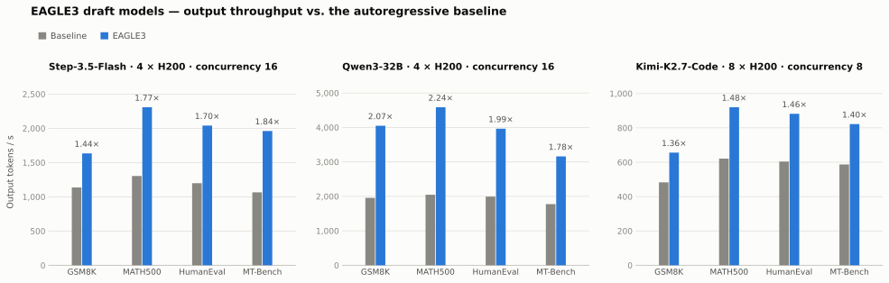
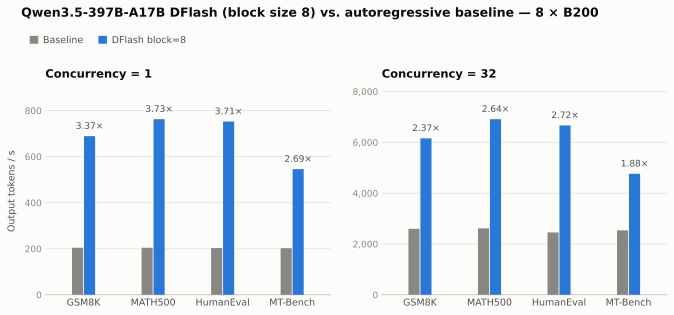
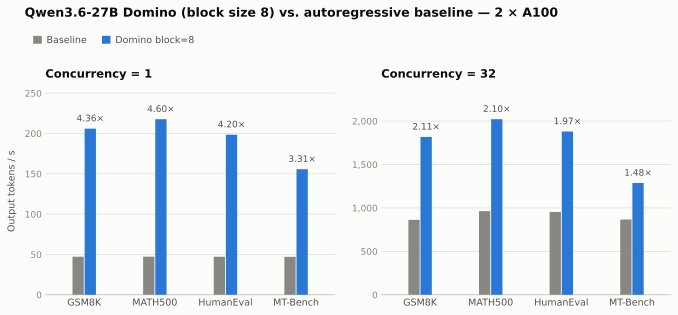

# SpecForge v0.3.0: a Unified Disaggregated and Colocated Speculative Decoding Stack, and New Open SpecBundle Draft Models

**The SpecForge Team · July 2026**

When we first released [SpecForge](https://www.lmsys.org/blog/2025-07-25-spec-forge/), our goal was to make EAGLE3 draft-model training practical and directly compatible with SGLang. Since then, speculative decoding has moved quickly: target models have grown, parallel drafting has become increasingly important, and a single training recipe must often span several inference servers and several trainer workers.

Today, we are introducing a major update to SpecForge. The new runtime separates target-model inference from draft-model training, supports a broader family of speculative decoding algorithms, and unifies online, offline, and disaggregated workflows behind one typed training entry point. Alongside the release, we are publishing more draft models, covering different speculative decoding methods and different target models.

## What's New

- **Online training is now fully disaggregated.** Patched SGLang servers capture target-model features, Mooncake transports the tensors, and trainer workers consume lightweight references through a separate control plane.
- **Inference and training can scale independently.** On our 8xH20 testbed, a topology with **3 SGLang servers and 5 trainer workers** improves end-to-end training throughput by approximately **10%** over our previous colocated implementation.
- **One runtime now supports multiple drafting families:** [EAGLE3](https://arxiv.org/abs/2503.01840), **EAGLE3.1**, [P-EAGLE](https://arxiv.org/abs/2602.01469), [DFlash](https://arxiv.org/abs/2602.06036), [Domino](https://arxiv.org/abs/2605.29707), and [DSpark](https://arxiv.org/abs/2607.05147), together with the optional [D-PACE](https://arxiv.org/abs/2605.18810) objective for DFlash.
- **More draft models are being released, most of them contributed by the community.** Partners and individual contributors have trained and published draft models with this runtime across different speculative decoding methods and different target models, all trained only on open data.

## Why Disaggregate Draft-Model Training?

Online draft-model training contains two very different workloads.

The **target side** runs a large, frozen model to generate tokens and capture hidden states. It is inference-heavy, often requires tensor parallelism, and benefits from a production inference engine. The **draft side** trains a much smaller model, performs forward and backward passes, and scales through data or sequence parallelism.

In the previous colocated design, these two workloads shared one lifecycle and one fixed resource layout. This introduced three practical limitations:

1. **A fixed inference-to-training ratio.** Adding trainer workers also affected how the target model was placed, even when only one side was the bottleneck.
2. **Resource interference.** Target-model capture and draft-model optimization competed for memory and compute within the same tightly coupled job.
3. **Synchronized stalls.** A slowdown or failure in feature generation could directly block the training process, while excess production could create unbounded memory pressure.

The key observation is simple: trainers do not need to own the target model. They only need the token sequences, masks, and target features required by the selected training objective. Once that boundary is explicit, inference and training can become independently scheduled pools.

## The New Disaggregated Architecture

The new online runtime has a producer pool and a consumer pool. The producer schedules prompts across one or more patched SGLang capture servers. SGLang writes captured tensors to Mooncake, while the producer publishes only lightweight `SampleRef` metadata. Consumer rank 0 durably records and distributes those references; each trainer then fetches the corresponding tensors directly from Mooncake.


*Figure 1. SpecForge's online-disaggregated training flow. Large tensors stay in the data plane; the control plane carries references and lifecycle state only.*

### 1. Server-only target capture

The online trainer no longer initializes a colocated target model. Instead, every URL in `deployment.disaggregated.server_urls` creates one rollout worker connected to a patched SGLang server. The workers lease disjoint prompts from a shared controller, so adding a server increases capture capacity without changing the trainer topology.

This also establishes a clean ownership boundary: SGLang owns target-model parallelism and feature capture, while SpecForge owns prompt scheduling, reference publication, and draft-model optimization.

### 2. Tensors and metadata take different paths

Captured hidden states can be large, so forwarding them through a Python queue or a control database would quickly become a bottleneck. SpecForge instead uses a `FeatureStore` abstraction:

- SGLang writes feature tensors to Mooncake.
- The producer publishes tensor-free `SampleRef` records.
- `FeatureDataLoader` is the only component that resolves references into tensor-carrying training batches.
- Trainers release feature objects after a durable optimizer-step acknowledgement.

This split keeps the control plane small and makes the training loop independent of the storage transport. The same trainer path can consume local files, a shared directory, or Mooncake-backed features.

### 3. Optimizer-aware flow control

Distributed training ranks must advance in lockstep. Before capture starts, consumer rank 0 publishes a global dispatch quantum:

```text
quantum = world_size × per_rank_batch_size × gradient_accumulation_steps
```

References are released only in complete quantum-sized windows. Each rank therefore receives exactly the samples needed for one optimizer step, and an incomplete tail at end-of-stream is never dispatched as a partial distributed step.

The producer also observes high and low in-flight watermarks. When the number of committed but unacknowledged samples reaches the high watermark, capture pauses; it resumes only after consumption falls below the low watermark. Optional resident-byte limits provide an additional guard against feature-store pressure.

### 4. Durable recovery and failure handling

Consumer rank 0 is the only writer to the retaining SQLite ledger. At every optimizer boundary, SpecForge commits trained sample IDs, removes their feature objects, and then advances the channel counters. A crash before the transaction replays the untrained references; a crash after it skips the already committed samples.

On the producer side, a failed server returns its leased prompts to the controller, and the remaining workers continue. The run fails loudly when every capture server is unavailable or retry limits are exhausted. This makes server failures explicit without allowing them to silently corrupt the training stream.

### 5. One configuration and one training entry point

The topology is described in the same typed YAML as the model, algorithm, data, and optimizer settings:

```yaml
model:
  target_model_path: zai-org/GLM-5.2-FP8
  draft_model_config: configs/glm-5.2-dspark.json
  target_backend: sglang
  trust_remote_code: true
data:
  train_data_path: ./cache/dataset/glm52_dspark_train.jsonl
  max_length: 4096
  chat_template: glm-5.2
  cache_dir: cache
  build_dataset_num_proc: 64
training:
  strategy: dspark
  num_epochs: 10
  batch_size: 1
  accumulation_steps: 512
  learning_rate: 0.0006
  warmup_ratio: 0.04
  max_grad_norm: 1.0
  num_anchors: 512
  loss_decay_gamma: 4.0
  objective_chunk_blocks: 128
  # Optimizer-step equivalent of about 500 source microsteps at microbatch 16.
  save_interval: 16
  dist_timeout: 30
  seed: 42
run_id: glm-5.2-dspark-disaggregated
output_dir: outputs/glm-5.2-dspark-disaggregated
deployment:
  mode: disaggregated
  trainer:
    nnodes: 1
    nproc_per_node: 1
  disaggregated:
    control_dir: outputs/glm-5.2-dspark-disaggregated/control
    backend: mooncake
    server_urls: [http://127.0.0.1:30000]
    mooncake_metadata_server: http://127.0.0.1:35880/metadata
    mooncake_master_server_addr: 127.0.0.1:35551
    mooncake_protocol: rdma

```


The same public command resolves and launches the selected topology:

```bash
specforge train --config run.yaml
```

For scheduler-managed multi-node deployments, the two pools can be launched explicitly without introducing a second trainer implementation:

```bash
# Inference and ingestion pool
specforge train --config run.yaml --role producer

# Draft-model training pool
specforge train --config run.yaml --role consumer
```

## Preliminary System Result: 3 Servers + 5 Trainers on H20

We evaluated the new runtime on our H20 testbed. Reallocating the workload of Qwen3-8B Domino with 3k context length into three SGLang capture servers and five trainer workers increased end-to-end training throughput by approximately 10% compared with the previous colocated version.

| Runtime | Target capture | Draft training | Relative end-to-end training throughput |
| --- | --- | --- | ---: |
| Previous colocated version | Coupled with the training job | Fixed colocated layout | 1.00× |
| New disaggregated runtime | 3 SGLang servers | 5 trainer workers | **1.10×** |

The following GPU profiles show representative training windows for Qwen3-8B Domino at a 3k context length under the two runtime topologies.

**(a) Colocated baseline**


**(b) Disaggregated: 3 SGLang servers + 5 trainer workers**


*Figure 2. Qwen3-8B Domino training profiles at a 3k context length. The colocated baseline is shown above and the 3-server/5-trainer disaggregated run is shown below.*

The improvement comes from matching resources to the actual pipeline balance: target feature generation and draft optimization can progress concurrently, and neither pool needs to inherit the other's parallelism layout. Just as importantly, the new topology gives us a practical way to tune this balance for different target-model sizes, sequence lengths, and algorithms.


## From EAGLE3 to a Multi-Algorithm Training Stack

SpecForge began with a strong focus on EAGLE3. The current release turns the runtime into a common training substrate for autoregressive, parallel, block-diffusion, and semi-autoregressive drafters.

| Method | Core idea | SpecForge support |
| --- | --- | --- |
| [EAGLE3](https://arxiv.org/abs/2503.01840) | Direct token prediction with training-time test and multi-layer target-feature fusion | Online-disaggregated, colocated offline, and disaggregated offline training |
| [P-EAGLE](https://arxiv.org/abs/2602.01469) | Parallel multi-token prediction through a shared hidden state, with techniques for scalable long-context training | Online-disaggregated training |
| EAGLE3.1 | An EAGLE3 configuration variant with per-layer normalization and attention-drift settings | Online-disaggregated training through the `eagle3` strategy |
| [DFlash](https://arxiv.org/abs/2602.06036) | A lightweight block-diffusion drafter that predicts a token block in parallel while conditioning on target features | Online-disaggregated, colocated offline, and disaggregated offline training |
| [Domino](https://arxiv.org/abs/2605.29707) | A parallel draft backbone followed by a lightweight causal correction head | Online-disaggregated, colocated offline, and disaggregated offline training |
| [DSpark](https://arxiv.org/abs/2607.05147) | A semi-autoregressive drafter with confidence modeling for adaptive verification | Online-disaggregated, colocated offline, and disaggregated offline training |


## More Draft Models Across Methods and Targets

A training stack is only useful if it produces checkpoints people can actually deploy. Speculative decoding offers strong theoretical guarantees and consistent gains in token acceptance rate and end-to-end speed, but adoption in the open-source community has been limited by a lack of production-ready training tooling, a scarcity of high-quality draft checkpoints, and the small scale of the data those drafts were trained on.

So alongside the runtime, a much larger set of open draft models is now available — and the striking part is how few of them we trained ourselves. Teams running SpecForge in production have trained drafters for the targets they actually serve and contributed the weights back, all trained **only on open data**. Nine of the eleven checkpoints listed below came in this way, from **Ant Group AQ**, **RadixArk**, **China Merchants Bank**, the Domino authors, and individual community members.

That inflow is what broadened the catalog along two axes:

1. **Wider target coverage** of the open-source models the community actually deploys, extending from instruct-tuned models into reasoning models and the current frontier of open-weight releases.
2. **Wider method coverage.** Following the algorithms described in the previous section, the released checkpoints now span **EAGLE3**, **DFlash**, **Domino**, and **DSpark**. Several targets in scope also ship a **native MTP** head, giving the community a chance to compare these drafters against native MTP on the same target.

If you have trained a draft model with SpecForge, we would like to host it alongside these — contributions of new targets and new algorithms are both welcome.

### Released models and performance

All checkpoints are published in the [SpecBundle collection](https://huggingface.co/collections/lmsys/specbundle) on Hugging Face:

| Target model | Draft model | Algorithm | Provider |
| --- | --- | --- | --- |
| GLM-5.1 | [🤗](https://huggingface.co/AQ-MedAI/GLM-5.1-eagle3) | EAGLE3 | Ant Group AQ |
| Kimi-K2.5 | [🤗](https://huggingface.co/AQ-MedAI/Kimi-K25-eagle3) | EAGLE3 | Ant Group AQ |
| Kimi-K2.6 | [🤗](https://huggingface.co/AQ-MedAI/Kimi-K26-eagle3) | EAGLE3 | Ant Group AQ |
| Kimi-K2.7-Code | [🤗](https://huggingface.co/AQ-MedAI/Kimi-K2.7-Code-eagle3) | EAGLE3 | Ant Group AQ |
| Qwen3-32B | [🤗](https://huggingface.co/CMBTech/CMB-Qwen3-32B-Eagle3) | EAGLE3 | China Merchants Bank |
| Qwen3.5-35B-A3B | [🤗](https://huggingface.co/jiapingW/Qwen3.5-35B-A3B-Eagle3-Specforge) | EAGLE3 | SpecForge |
| Step-3.5-Flash | [🤗](https://huggingface.co/lmsys/SGLang-EAGLE3-Step-3.5-Flash-SpecForge-RadixArk) | EAGLE3 | RadixArk |
| Qwen3.5-397B-A17B | [🤗](https://huggingface.co/lmsys/Qwen3.5-397B-A17B-DFlash) | DFlash | LMSYS |
| Qwen3.6-27B | [🤗](https://huggingface.co/Huang2020/qwen3.6-27B-domino) | Domino | Domino Team |
| Inkling-Small | [🤗](https://huggingface.co/RadixArk/Inkling-Small-DSpark-Preview) | DSpark | RadixArk |
| Kimi-K3 | [🤗](https://huggingface.co/RadixArk/Kimi-K3-DSpark) | DSpark | RadixArk |

Results for a subset of these models are shown below, grouped by algorithm.

#### EAGLE3



*Figure 3. Three EAGLE3 draft models at the same drafting configuration (3 steps, top-k 1, 4 draft tokens): output throughput against the autoregressive baseline, with the speedup labelled above each bar. Step-3.5-Flash and Qwen3-32B were measured on 4 × H200 at concurrency 16; the Kimi-K2.7-Code numbers are the 8 × H200, concurrency-8 results published on its [model card](https://huggingface.co/AQ-MedAI/Kimi-K2.7-Code-eagle3).*

#### DFlash



*Figure 4. Qwen3.5-397B-A17B on 8 × B200 (TP8, bfloat16, thinking enabled, greedy decoding, 4096 max output tokens): output throughput of DFlash at block size 8 against the autoregressive baseline. Block size 16 reaches higher still at concurrency 1 — up to 4.31× on HumanEval — while block size 8 is the stronger choice under load. Full numbers, including the MTP comparison, are on the [model card](https://huggingface.co/lmsys/Qwen3.5-397B-A17B-DFlash).*

#### Domino



*Figure 5. Qwen3.6-27B on 2 × A100 (TP2, BF16, thinking enabled, greedy decoding): output throughput of Domino at block size 8 against the autoregressive baseline, with the speedup labelled above each bar. The gain is largest at concurrency 1 — up to 4.60× on MATH500 — and narrows to 1.48–2.11× at concurrency 32, where the target model is already better utilized.*

The full per-workload numbers, including the other block sizes and the MTP and DFlash comparisons, are on the [model card](https://huggingface.co/Huang2020/qwen3.6-27B-domino).

#### DSpark


*Results to be added.*

## What's next

This release changes the unit of scaling in SpecForge. A run is no longer a trainer process that happens to contain a target model; it is a coordinated pipeline whose inference capacity, storage, and optimization capacity can be sized independently.

Our next steps are to finish releasing the draft models for the remaining target models above, and to continue expanding the algorithm and model catalog. We will also conduct testing and adaptation across additional hardware platforms, including but not limited to AMD and Ascend.

## Acknowledgements

We thank the SGLang and SpecForge communities, the authors of the supported speculative decoding methods, and all contributors who helped test the new runtime and algorithm integrations.

**SpecForge Team**: Jiaping Wang, Shenggui Li, Xiaoming Dong, Chao Wang

**RadixArk Team**: Cheng Mao

**Domino**: Jianuo Huang

**Ant Group AQ Team**: Yefei Chen

**China Merchants Bank Team**: Peixiang Tan
