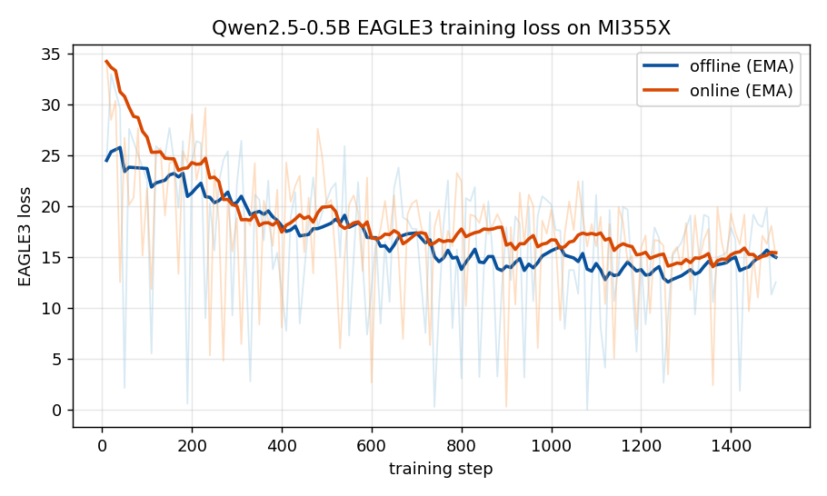
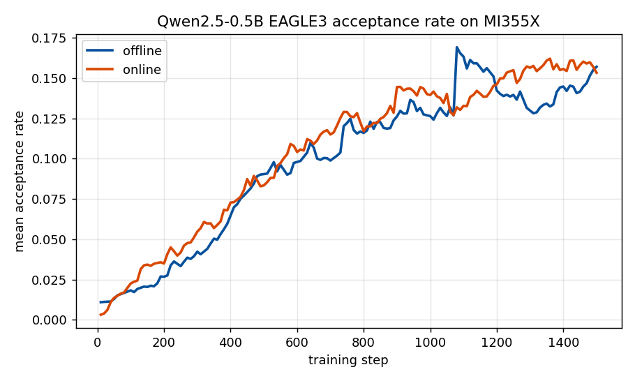
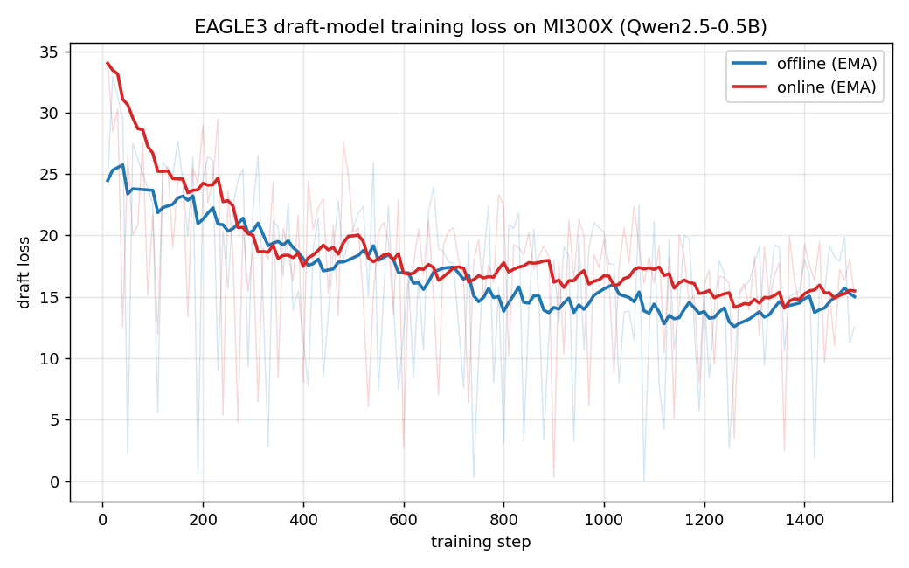
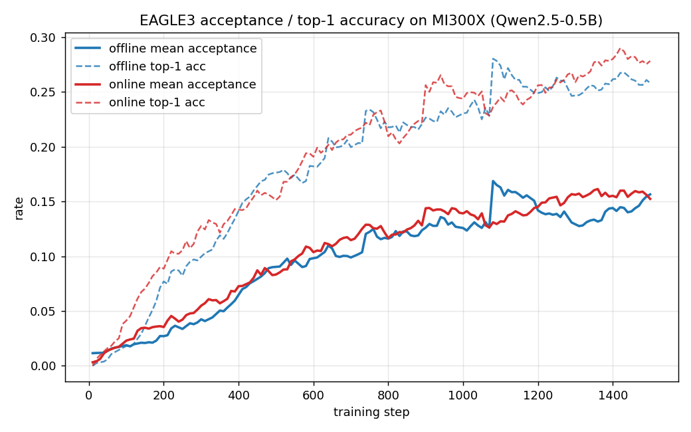

# 🚀 AMD ROCm Tutorial

This is an end-to-end tutorial for running SpecForge on AMD Instinct GPUs
(ROCm). It walks through the complete flow: **installation → data preparation →
offline training → online training → disaggregated training**.

All commands assume a ROCm host with the AMD driver stack and Docker already
installed. Validated on MI300X (gfx942) and MI355X (gfx950).

---

## 1. Installation

On ROCm, install SpecForge into an environment that already provides a ROCm
PyTorch and a ROCm SGLang, and install the package **without dependencies** so
pip does not pull CUDA wheels over the working ROCm stack.

The recommended base is an official SGLang ROCm release container. These ship a
ROCm PyTorch and an editable ROCm SGLang build, so SpecForge only needs to be
cloned and installed on top.

### Step 1: Pull the image for your accelerator

The accelerator is baked into the tag, so use the image that matches your
hardware:

```bash
# AMD Instinct MI300X (gfx942)
docker pull lmsysorg/sglang:v0.5.14-rocm720-mi30x

# AMD Instinct MI355X (gfx950)
docker pull lmsysorg/sglang:v0.5.14-rocm700-mi35x
```

### Step 2: Start the container

Expose the ROCm device nodes (swap in the tag for your accelerator). Use `--name`
and omit `--rm` so the checkout survives across sessions:

```bash
docker run -it --name specforge \
  --device=/dev/kfd --device=/dev/dri \
  --group-add video --cap-add SYS_PTRACE --security-opt seccomp=unconfined \
  --ipc=host --shm-size=16g \
  lmsysorg/sglang:v0.5.14-rocm720-mi30x \
  bash
```

`--device=/dev/kfd --device=/dev/dri --group-add video` are required for ROCm
GPU access; `--ipc=host --shm-size=16g` gives Mooncake and PyTorch enough shared
memory. Re-enter the running container later with `docker exec -it specforge bash`.

### Step 3: Clone and install SpecForge

Inside the container, clone SpecForge into `/workspace/SpecForge` and register it
in editable mode without touching the image's torch/sglang:

```bash
git clone https://github.com/sgl-project/SpecForge.git /workspace/SpecForge
cd /workspace/SpecForge
python -m pip install -e . --no-deps
```

`--no-deps` is mandatory: a full resolve pulls the CUDA SGLang stack and
clobbers the image's ROCm torch/sglang. If a later step reports a missing
lightweight dependency (for example `accelerate`), install just that package,
also with `--no-deps`.

### Step 4: Apply the capture patch (online runs only)

These images pin SGLang to exactly `0.5.14` (editable at `/sgl-workspace/sglang`),
so the online capture patch applies with a plain `git apply`. Skip this step for
offline training, which reads features from disk and needs no capture service:

```bash
cd /sgl-workspace/sglang
git apply /workspace/SpecForge/patches/sglang/v0.5.14/spec-capture.patch
cd /workspace/SpecForge
```

The patch adds the `--enable-spec-capture`, `--spec-capture-method`, and
`--spec-capture-aux-layer-ids` server flags plus the `sglang.srt.spec_capture_sink`
module used by online capture.

### Step 5: Attention backends on ROCm

Use the `sdpa` or `flex_attention` attention backends on ROCm. The `fa`
(flash-attn) and `usp` backends, and `yunchang`-based Ulysses/Ring sequence
parallel (`sp_ulysses_size` / `sp_ring_size` > 1), depend on a CUDA flash-attn
build; the single-GPU / data-parallel path never loads `yunchang`, and selecting
those backends raises a clear error. The checked-in
[`qwen3-8b-eagle3-offline.yaml`](../../../examples/configs/qwen3-8b-eagle3-offline.yaml)
recipe already uses `flex_attention`, so it runs on ROCm unchanged as a
single-GPU offline EAGLE3 example.

---

## 2. Data preparation

Data preparation is platform independent — the same scripts run on ROCm. Write a
ShareGPT training set into `cache/dataset` from the repository root:

```bash
python scripts/prepare_data.py --dataset sharegpt
```

This produces `./cache/dataset/sharegpt_train.jsonl` in the stable
`id` + `conversations` contract used by every checked-in recipe. For the full
preset list, custom datasets, preformatted text, and target-model regeneration,
see the [Data Preparation](../data_preparation.md) guide.

---

## 3. Offline training

Offline training reads target features from disk, so the trainer only has to fit
the draft model. It uses more storage but keeps target inference out of the
training loop, and needs no capture patch or Mooncake.

### Step 1: Capture hidden states

Feature preparation is a data-processing step, not a second training entry point:

```bash
torchrun --standalone --nproc_per_node 8 \
  scripts/prepare_hidden_states.py \
  --target-model-path Qwen/Qwen3-8B \
  --data-path ./cache/dataset/sharegpt_train.jsonl \
  --output-path ./cache/hidden_states/qwen3-8b-sharegpt \
  --chat-template qwen \
  --max-length 4096 \
  --tp-size 1 \
  --batch-size 32
```

The output path matches `data.hidden_states_path` in the checked-in offline
recipe. See [Data Preparation](../data_preparation.md#option-2-pre-formatted-text-format)
for preformatted inputs and other options.

### Step 2: Train

The checked-in offline recipe already uses `flex_attention`, so it runs on ROCm
unchanged:

```bash
specforge train --config examples/configs/qwen3-8b-eagle3-offline.yaml
```

Override any field inline without copying the YAML, e.g. a quick smoke run:

```bash
specforge train --config examples/configs/qwen3-8b-eagle3-offline.yaml \
  training.max_steps=20 output_dir=./outputs/eagle3-offline-smoke
```

See the [Training](../training.md) guide for the full run schema,
checkpoint/resume rules, and evaluation.

---

## 4. Online training

Online training captures target features live from a patched SGLang server and
streams them through Mooncake to the trainer. Every online run is
**disaggregated**: a producer drives prompts through the capture server and a
consumer trains the draft model. With `deployment.trainer.nnodes: 1` and no
`--role`, a single `specforge train` command supervises both.

This section uses the small
[`qwen2.5-0.5b-eagle3-online.yaml`](../../../examples/configs/qwen2.5-0.5b-eagle3-online.yaml)
recipe as a single-node smoke test. Complete Step 4 of the installation first.

### Step 1: One-time run inputs

EAGLE3 disaggregated runs require an explicit **shared vocabulary mapping** (the
producer and consumer cannot each derive one). The recipe expects it at
`cache/vocab_mapping/qwen2.5-0.5b-eagle3.pt`:

```bash
python - <<'PY'
from datasets import Dataset
from transformers import AutoTokenizer
from specforge.data.preprocessing import build_eagle3_dataset, generate_vocab_mapping_file
import json

rows = [json.loads(l) for l in open("cache/dataset/sharegpt_train.jsonl")]
tok = AutoTokenizer.from_pretrained("Qwen/Qwen2.5-0.5B-Instruct", trust_remote_code=True)
eds = build_eagle3_dataset(Dataset.from_list(rows), tok,
    chat_template="qwen", max_length=512, num_proc=8)
path = generate_vocab_mapping_file(eds, target_vocab_size=151936,
    draft_vocab_size=16000, cache_dir="cache/vocab_mapping",
    cache_key="qwen2.5-0.5b-eagle3")
print("vocab mapping:", path)
PY
```

The consumer's target head loader reads the LM-head weight from a `*.index.json`
weight map. Qwen2.5-0.5B ships a single `model.safetensors` with **tied
embeddings** (no standalone `lm_head.weight`), so build a small local target
directory that adds an index and points at the tied weight:

```bash
python - <<'PY'
import os, json, glob
from safetensors import safe_open

snap = glob.glob(os.path.expanduser(
    "~/.cache/huggingface/hub/models--Qwen--Qwen2.5-0.5B-Instruct/snapshots/*"))[0]
dst = "outputs/online-test/target_model"
os.makedirs(dst, exist_ok=True)
for f in os.listdir(snap):
    if f.endswith(".index.json"):
        continue
    lnk = os.path.join(dst, f)
    if os.path.lexists(lnk):
        os.remove(lnk)
    os.symlink(os.path.realpath(os.path.join(snap, f)), lnk)

wm, total = {}, 0
with safe_open(os.path.join(dst, "model.safetensors"), framework="pt") as fh:
    for k in fh.keys():
        wm[k] = "model.safetensors"
        n = 1
        for s in fh.get_slice(k).get_shape():
            n *= s
        total += n * 2
json.dump({"metadata": {"total_size": total}, "weight_map": wm},
    open(os.path.join(dst, "model.safetensors.index.json"), "w"), indent=2)
print("target model:", os.path.abspath(dst))
PY
```

Larger sharded models (for example Qwen3-8B) already ship an index and a
standalone LM head, so they need neither of these workarounds.

### Step 2: Start Mooncake and the capture server

Start the Mooncake master. **Set `--default_kv_lease_ttl=500`**: the consumer's
teardown drain retries for only ~1.75s, so Mooncake's stock 5000ms lease leaves
keys pinned past the drain window and fails an otherwise successful shutdown.

```bash
mooncake_master --enable_http_metadata_server=true \
  --rpc_port=35551 --http_metadata_server_port=35880 \
  --metrics_port=35903 --enable_metric_reporting=false \
  --default_kv_lease_ttl=500 &
```

Start the patched capture server on GPU 0. **The `--spec-capture-aux-layer-ids`
must match the layers the producer derives** for EAGLE3:
`[1, num_layers//2 - 1, num_layers - 4]`. Qwen2.5-0.5B has 24 layers, so the ids
are `1 11 20`. A mismatch produces zero features with no error.

```bash
HIP_VISIBLE_DEVICES=0 CUDA_VISIBLE_DEVICES=0 \
MOONCAKE_LOCAL_HOSTNAME=127.0.0.1 \
MOONCAKE_METADATA_SERVER=http://127.0.0.1:35880/metadata \
MOONCAKE_MASTER_SERVER_ADDR=127.0.0.1:35551 \
MOONCAKE_PROTOCOL=tcp \
MOONCAKE_GLOBAL_SEGMENT_SIZE=$((32<<30)) \
python -m sglang.launch_server \
  --model-path Qwen/Qwen2.5-0.5B-Instruct \
  --trust-remote-code --skip-tokenizer-init \
  --tp-size 1 --context-length 2048 --mem-fraction-static 0.85 \
  --chunked-prefill-size -1 --disable-radix-cache \
  --enable-spec-capture --spec-capture-method eagle3 \
  --spec-capture-aux-layer-ids 1 11 20 \
  --host 127.0.0.1 --port 30000 &
```

Wait for `curl --fail http://127.0.0.1:30000/health` to return 200 (the first
health check can take a few minutes while attention kernels compile).
`--context-length` must exceed `data.max_length` (512) or `/generate` returns
`400 input longer than context length`.

### Step 3: Launch training

One command supervises producer and consumer on GPU 1:

```bash
CUDA_VISIBLE_DEVICES=1 HIP_VISIBLE_DEVICES=1 \
MOONCAKE_LOCAL_HOSTNAME=127.0.0.1 \
MOONCAKE_METADATA_SERVER=http://127.0.0.1:35880/metadata \
MOONCAKE_MASTER_SERVER_ADDR=127.0.0.1:35551 \
MOONCAKE_PROTOCOL=tcp \
MOONCAKE_GLOBAL_SEGMENT_SIZE=$((32<<30)) \
specforge train -c examples/configs/qwen2.5-0.5b-eagle3-online.yaml \
  model.target_model_path=outputs/online-test/target_model \
  model.lm_head_key=model.embed_tokens.weight \
  training.max_steps=20 training.num_epochs=1 \
  training.save_interval=20 training.log_interval=5
```

Before rerunning, clear stale control state:
`rm -rf outputs/qwen2.5-0.5b-eagle3-online`.

### Success criteria

- Producer log: `drive_producer returning produced=<N> prompts_failed=0`.
- Consumer log: `step N: {...loss..., acceptance_rate...}` lines, and **no**
  `could not drain` error or traceback at teardown.
- Checkpoint: `outputs/qwen2.5-0.5b-eagle3-online/qwen2.5-0.5b-eagle3-online-step20/`
  contains `training_state.pt` and `training_state_rank0.pt`.

> If `produced=0`, the capture aux-layer ids do not match the producer contract
> (see Step 2). If training succeeds but teardown reports `could not drain`, the
> Mooncake lease TTL is above the drain window (see Step 2).

### Managed-local shortcut

Instead of starting Mooncake and the capture server by hand, a
`deployment.disaggregated.managed_local` block lets one `specforge train`
command own those local processes and derive their endpoints. It defaults
`default_kv_lease_ttl_ms` to 500, so the lease-TTL fix is applied automatically.
See [Multi-server capture](../disaggregated_training.md#multi-server-capture)
for the managed-local profile.

---

## 5. Disaggregated training

Online training is already a disaggregated producer/consumer topology; Section 4
runs both roles under one single-node supervisor. To split the roles across
process pools or nodes, use the **same config** with an explicit `--role`:

```bash
# Inference / capture pool
specforge train -c examples/configs/qwen2.5-0.5b-eagle3-online.yaml --role producer

# Trainer pool
specforge train -c examples/configs/qwen2.5-0.5b-eagle3-online.yaml --role consumer
```

For multiple consumer nodes, record `deployment.trainer.nnodes`,
`nproc_per_node`, `master_addr`, and `master_port` once in the config, then pass
only the node-local identity on each trainer host:

```bash
specforge train -c run.yaml --role consumer --node-rank 0   # trainer-0
specforge train -c run.yaml --role consumer --node-rank 1   # trainer-1
```

A fresh attempt requires fresh control and consumer-state directories, and every
capture server must use the same target model, revision, capture method, and
auxiliary layer ids. Offline features can also be served through a disaggregated
shared-directory or Mooncake store. For external-service prerequisites,
freshness rules, multi-server capture, and resume, see the
[Disaggregated training](../disaggregated_training.md) guide.

---

## Reference results on MI355X

The offline and online recipes above were run end-to-end on a single AMD
Instinct **MI355X** (gfx950) inside the `lmsysorg/sglang:v0.5.14-rocm720-mi35x`
container, training a **Qwen2.5-0.5B** EAGLE3 draft head on ShareGPT
(`max_length=512`, `ttt_length=7`, `flex_attention`, `batch_size=1`,
`learning_rate=1e-4`) for 1,500 steps. Offline consumes hidden states captured
to disk by `prepare_hidden_states.py`; online consumes the same features
streamed live from a patched SGLang capture server through Mooncake. Both paths
converge to the same loss and acceptance rate — the online capture path
reproduces offline quality on ROCm.

### Training loss



Draft-head loss falls from ~25–34 to ~15 over 1,500 steps. Faint lines are raw
per-step values; bold lines are an exponential moving average. (Offline logs a
handful of all-zero steps where a batch is fully truncated at `max_length`; those
degenerate points are filtered from the curve.)

### Acceptance rate



Mean draft-token acceptance rate — the quantity that translates into speculative
decoding speedup at serving time — rises from ~0.01 to ~0.15 and the two paths
track each other closely.

### Summary

| Metric (final) | Offline | Online |
| --- | --- | --- |
| Draft loss (start → end) | 24.5 → 15.2 | 34.2 → 15.2 |
| Top-1 draft accuracy (`acc_0`) | ~0.24 | ~0.25 |
| Mean acceptance rate | ~0.16 | ~0.15 |
| Training steps | 1,500 | 1,500 |

**Throughput** (single MI355X GCD, `batch_size=1`, sequence length 512):

- **Offline** trainer: ~3–4 steps/s (pure GPU-local training; no capture server
  in the loop).
- **Online** trainer: ~1.7 steps/s end-to-end, bounded by a single capture
  server producing ~1.9 prompts/s at ~10k tokens/s. The producer generated
  1,719 prompts with **0 failures**; add more `capture_servers` to raise
  producer throughput.

These numbers are a functional reference for a 0.5B draft on one GCD, not a tuned
performance benchmark — larger targets, longer sequences, and multi-GPU trainers
scale differently.

## Reference results on MI300X

The same offline and online recipes were replicated on a single AMD Instinct
**MI300X** (gfx942) inside the `lmsysorg/sglang:v0.5.14-rocm720-mi30x` container,
with identical hyperparameters (**Qwen2.5-0.5B** EAGLE3 head on ShareGPT,
`max_length=512`, `ttt_length=7`, `flex_attention`, `batch_size=1`,
`learning_rate=1e-4`, 1,500 steps). The capture server used the `triton`
attention backend (flashinfer is CUDA-only). This node was shared with another
tenant, so the capture server and trainer each ran with a small
`sglang_mem_fraction_static` (~0.12) on separate GPUs; on an idle MI300X you can
raise these and expect higher throughput.

### Training loss



Draft-head loss falls from ~25–34 to ~15 over 1,500 steps, matching the MI355X
run. Faint lines are raw per-step values; bold lines are an exponential moving
average.

### Acceptance rate



Mean draft-token acceptance rate rises from ~0.01 to ~0.15 and the offline and
online paths track each other closely — the online capture path reproduces
offline quality on gfx942 as well.

### Summary

| Metric (final) | Offline | Online |
| --- | --- | --- |
| Draft loss (start → end) | 24.5 → 15.0 | 34.0 → 15.5 |
| Top-1 draft accuracy (`acc_0`) | ~0.26 | ~0.28 |
| Mean acceptance rate | ~0.16 | ~0.15 |
| Training steps | 1,500 | 1,500 |

**Throughput** (single MI300X, `batch_size=1`, sequence length 512, GPUs shared
with another tenant at ~0.12 mem fraction):

- **Offline** trainer: ~5–8 steps/s (pure GPU-local training; no capture server
  in the loop).
- **Online** trainer: ~7 steps/s end-to-end (1,500 steps in ~200 s). The managed
  `triton` capture server sustained ~38k tokens/s prefill and the producer
  generated 1,695 prompts with **0 failures**; the single-command
  `managed_local` stack (Mooncake master + capture server + trainer) came up and
  tore down cleanly (`default_kv_lease_ttl_ms=500`, no drain failure).

As with the MI355X figures, these are a functional cross-architecture reference
(gfx942 vs gfx950), not a tuned performance benchmark.
