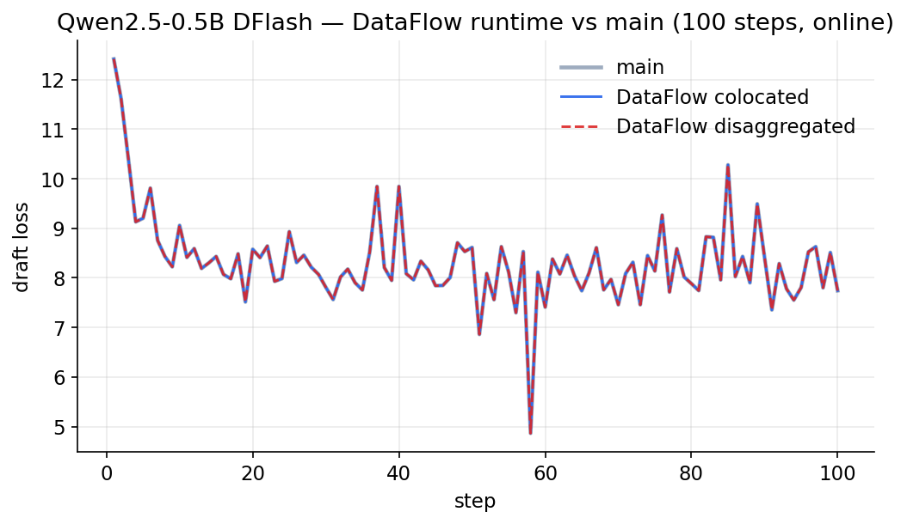
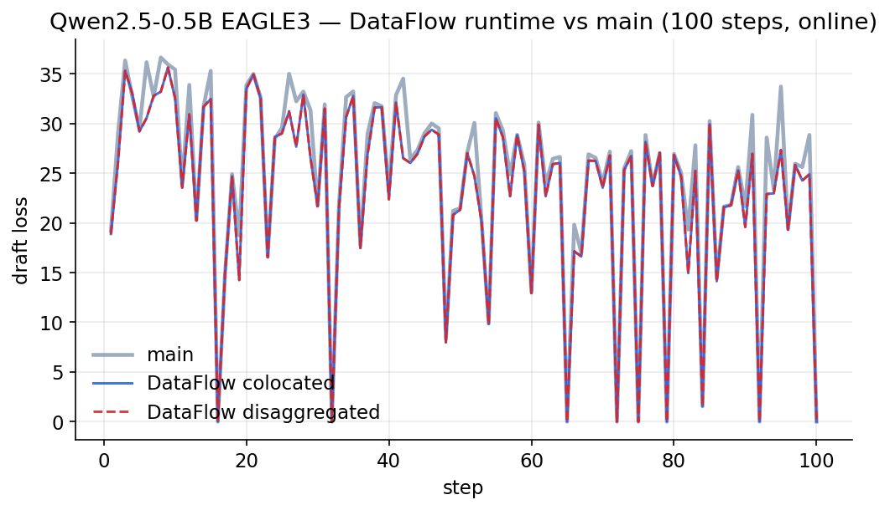
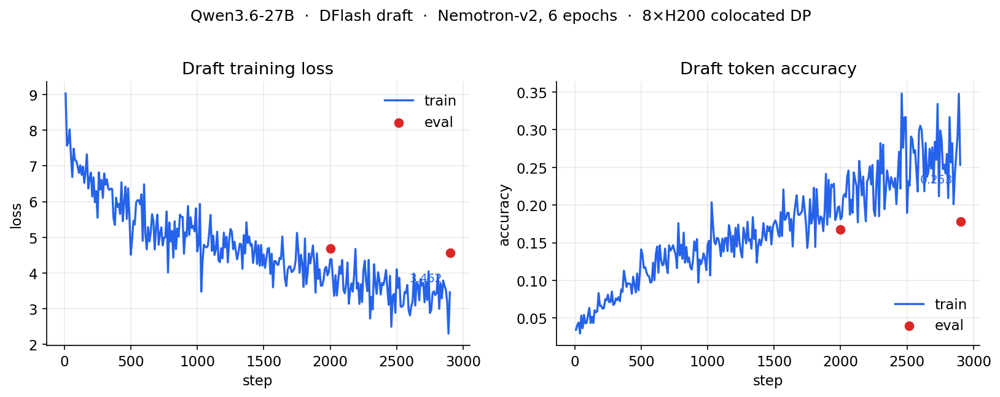
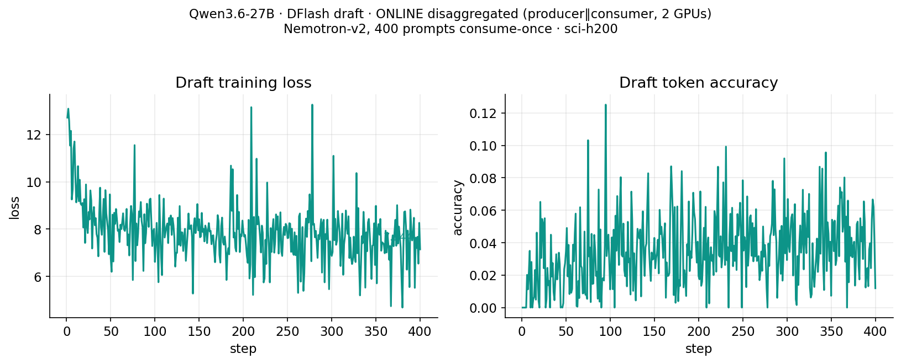

# Benchmarking speculative decoding

The repository keeps the model-quality and serving-performance benchmark suite
under `benchmarks/`. It is independent from training: train and export a draft
through the unified `specforge` CLI, then benchmark that exported artifact
against an SGLang server.

## Run server and benchmarks together

From the repository root:

```bash
python benchmarks/bench_eagle3.py \
    --model-path meta-llama/Llama-3.1-8B-Instruct \
    --speculative-draft-model-path /path/to/exported-draft \
    --port 30000 \
    --trust-remote-code \
    --mem-fraction-static 0.8 \
    --tp-size 1 \
    --attention-backend fa3 \
    --config-list 1,0,0,0 1,3,1,4 \
    --benchmark-list mtbench gsm8k:5 ceval:5:accountant \
    --dtype bfloat16
```

Each `--config-list` entry is
`batch-size,num-steps,topk,num-draft-tokens`. Benchmark selectors use
`name[:num-prompts[:subset,...]]`. Available datasets include AIME, C-Eval,
FinanceQA, GPQA, GSM8K, HumanEval, LiveCodeBench, MATH-500, MBPP, MMLU,
MMStar, MT-Bench, and SimpleQA.

## Benchmark an existing server

Start SGLang separately, then add `--skip-launch-server`:

```bash
python benchmarks/bench_eagle3.py \
    --model-path meta-llama/Llama-3.1-8B-Instruct \
    --port 30000 \
    --config-list 1,3,1,4 \
    --benchmark-list mtbench:5 gsm8k:5 humaneval:5 math500:5 \
    --skip-launch-server
```

Results are written as timestamped JSON under `--output-dir`. The standalone
GPU microbenchmarks `bench_domino_mfu.py`,
`specforge/benchmarks/benchmark_flex_attention.py`, and
`specforge/benchmarks/benchmark_loss.py` cover trainer MFU, attention, and loss
kernel behavior respectively.

HumanEval and MBPP execute model-generated Python while scoring. Run those two
benchmarks only in an isolated container or devbox with no credentials or
production data mounted.

## Retained validation artifacts

The repository keeps the existing training-equivalence and convergence plots
as provenance for the runtime cutover. They are reference results, not a
substitute for rerunning the benchmark suite on the current commit.

### DataFlow cutover equivalence

These 100-step traces compare the former trainer (`main`) with colocated and
disaggregated DataFlow execution. Keeping them next to the benchmark suite
makes the behavioral evidence available after the duplicate trainers are
removed.





### Qwen3.6-27B DFlash training curves

The retained curves cover both the eight-H200 colocated run and the two-GPU
online-disaggregated producer/consumer run.

The separate [Domino disaggregated performance findings](domino-disaggregated-performance.md)
preserve the measured one-server + DP7 tuning study, its MFU analysis, and the
canonical YAML form of the relevant controls.




