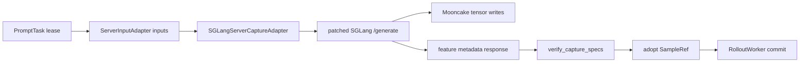

# Inference plane design (`specforge.inference`)

The inference plane is an external-server transport boundary. Online training
does not load or execute a target model in a trainer or producer process.

## Responsibility

`SGLangServerCaptureAdapter` sends model inputs and capture metadata to a
patched SGLang server. The server performs prefill and writes captured tensors
directly to Mooncake. Its response contains only sample ids and feature
key/shape/dtype metadata. The adapter validates those feature specifications,
adopts the server-written objects into the producer store, and returns
`SampleRef`s for `RolloutWorker` to commit.

Algorithm registrations own the requested capture layout, target
representation, collator, and optional modality-specific `ServerInputAdapter`.
The transport owns sampling and capture metadata. This keeps target execution,
algorithm policy, and deployment wiring separate.

`RolloutWorker` treats this adapter as a `RefSource`: it leases tasks, calls
`produce_refs`, and commits only metadata. Per-task server failures remain
retryable without failing successful tasks from the same batch. Tensors never
pass through the controller or the producer process.

## Offline capture

The separate `specforge.offline_capture` package is used only by
`scripts/prepare_hidden_states.py`. It contains the version-pinned local SGLang
internals needed to generate precomputed EAGLE3 features. It is not imported by
online application or training assembly.

## Endpoints

| From | Endpoint | Plane |
|---|---|---|
| `RolloutWorker` | `DataFlowController.lease_prompt_tasks` | control |
| `RolloutWorker` | `SGLangServerCaptureAdapter.produce_refs` | inference |
| `SGLangServerCaptureAdapter` | patched SGLang `/generate` | external compute |
| patched SGLang | Mooncake feature keys | data |
| `SGLangServerCaptureAdapter` | `MooncakeFeatureStore.adopt` | data |
| `RolloutWorker` | `DataFlowController.commit_samples` | control |
| producer | `StreamingRefChannel.publish` | data |
