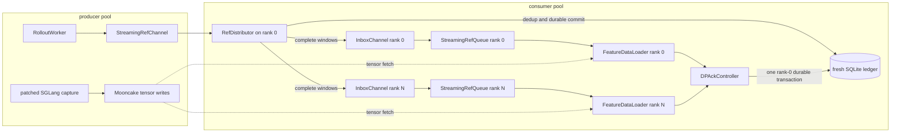

# SpecForge runtime architecture

SpecForge has one public training entry point, `specforge train`. A typed run
configuration selects a strategy and a topology; it does not select a second
trainer. The launch layer exposes exactly five topology builders:

- `build_offline_runtime`
- `build_disagg_offline_runtime`
- `build_online_runtime`
- `build_disagg_online_producer`
- `build_disagg_online_consumer`

All trainer-bearing builders converge on the same
`Trainer -> FeatureDataLoader -> TrainerController -> TrainerCore` path. Only
the reference source and feature-store backend change.

## Supported paths

| Mode | Producer side | Consumer reference source | Feature store | Iteration contract |
| --- | --- | --- | --- | --- |
| Colocated offline | Precomputed feature files | Fixed `SampleRef` list | `LocalFeatureStore` reads `file://` refs | Re-iterable; epochs and checkpoint resume are supported |
| Disaggregated offline | `run_offline.sh --role producer` ingests existing files and writes a static manifest | Fixed manifest refs | Shared directory or Mooncake | Re-iterable; DP/multi-node epochs and checkpoint resume are supported |
| Colocated online | `RolloutWorker` captures on demand | `LocalRolloutStream` | Private `LocalFeatureStore` | Consume once; deterministic resume rebuilds the untrained prompt suffix; no second pass over produced refs |
| Disaggregated online | Patched SGLang server writes tensors; producer publishes refs | Per-rank `StreamingRefQueue` inbox | Mooncake | Consume once; consumer-only recovery reconciles retained state; no producer resume or second pass |

`training.num_epochs` on an online run controls how many prompt passes the
producer creates. Each pass receives new task and sample ids. The consumer
still iterates one consume-once stream exactly once; it never replays a prior
stream as a second trainer epoch.

## Cross-plane contracts

- The control plane carries `PromptTask` and `SampleRef` metadata only.
  `assert_no_tensors` enforces this boundary.
- The data plane carries feature tensors behind `FeatureStore` URIs.
- `FeatureDataLoader` is the only bridge from refs plus a store to a
  tensor-carrying `TrainBatch`.
- The inference plane captures target features through the generic
  `TargetEngine`/server-capture adapter and commits only refs.
- The training plane resolves a `DraftTrainStrategy`; the core training loop
  does not branch on online, offline, colocated, or disaggregated deployment.

## Canonical online-disaggregated flow

There is one consumer path for both one-rank and multi-rank runs:



The producer owns prompt scheduling only. It uses a no-op training ledger and
has its local sample queue disabled. Rank 0 of the
consumer is the only reader of the shared source channel and the only writer
to the attempt's fresh retaining ledger. `RefDistributor` deduplicates refs and
dispatches them round-robin into one private inbox per rank. Every rank adapts
its `InboxChannel` through `StreamingRefQueue` and feeds the same
`FeatureDataLoader` implementation.

At each optimizer boundary, all ranks call `DPAckController.ack_train_refs` in
lockstep. It gathers their sample ids and rank 0 records one durable ack
transaction. Only after that commit succeeds does each rank delete its local
feature ids; cleanup errors are gathered before inbox acknowledgement. Inbox
acknowledgements are also mirrored to the source channel so the producer's
in-flight counter tracks refs that ranks have actually consumed.

### Optimizer-window handshake

Before capture starts, consumer rank 0 publishes the global dispatch quantum:

```text
quantum = dp_size * batch_size * accumulation_steps
```

The producer waits for this sidecar and refuses to run when its in-flight high
watermark is smaller than `quantum`. The canonical CLI reads
`DISAGG_IN_FLIGHT_HIGH_WATERMARK`, which defaults to `256`.

`RefDistributor` releases refs only in complete `quantum` windows, giving every
rank exactly `batch_size * accumulation_steps` refs per optimizer step. If EOF
leaves a partial window, the attempt fails loudly: those refs are marked
terminal, their feature-store objects are aborted best-effort, the source
counter is settled, and failure sentinels poison every inbox. A partial global
optimizer step is never reported as successful completion.

Every online producer requires fresh source-channel, store-id, and run-id
artifacts. A fresh consumer requires a fresh SQLite ledger and rank 0 recreates
its inboxes. Consumer-only recovery may instead reuse the retained ledger,
channel/inboxes, Mooncake objects, and an exactly matching checkpoint; it
reconciles the unacknowledged suffix but never restarts the producer.

## Other topology flows

### Colocated online

`LocalRolloutStream` is a bounded pull-through queue facade. The loader asks for
one batch, rollout workers capture only enough refs to satisfy it, and the
trainer consumes those refs before requesting more. The controller's private
in-process queue is an implementation detail of this local lifecycle; it is not
the disaggregated transport.

### Offline

Offline consumers receive a fixed ref list. Colocated refs point directly at
precomputed files. The disaggregated producer copies or publishes those
features into the selected cross-process store and writes one immutable
manifest; the consumer waits for the success sentinel and reads that manifest.
Both variants use `FeatureDataLoader` refs mode, so the data is re-iterable and
the loader can seek to a persisted offline resume position.

## Per-plane notes

- [`contracts.py`](contracts.py) and [`CONTRACTS.md`](CONTRACTS.md) — shared
  metadata and tensor contracts
- [`control_plane/DESIGN.md`](control_plane/DESIGN.md) — prompt lifecycle,
  metadata ledgers, distributed ack authority
- [`data_plane/DESIGN.md`](data_plane/DESIGN.md) — stores, channels,
  distribution, loading, and cleanup
- [`../inference/DESIGN.md`](../inference/DESIGN.md) — rollout and capture
- [`../training/DESIGN.md`](../training/DESIGN.md) — trainer, strategy, and
  backend
