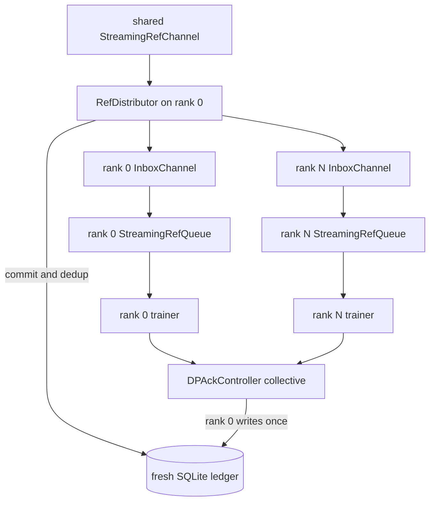

# Control plane design

The control plane moves metadata only. Its public record-accepting endpoints run
`assert_no_tensors`; feature tensors stay behind the data-plane `FeatureStore`.
The whole-system topology is documented in
[`../ARCHITECTURE.md`](../ARCHITECTURE.md).

## Responsibilities

`DataFlowController` provides the shared metadata primitives:

- prompt ingest, leasing, retry, and terminal failure;
- `SampleRef` commit deduplication;
- an in-process lease/ack/fail queue used by colocated online and as private
  rank-0 staging inside the online distributor;
- trainer registration and optimizer-boundary ack transactions;
- status for active prompt, queue, and durable-ack state.

The launch topology decides which subset is active. The controller has no run
loop and never calls a rollout worker or trainer.

## Topology-specific ownership

| Topology | Controller/ledger ownership | Reference delivery |
| --- | --- | --- |
| Colocated offline | No ledger or staging queue | Fixed, re-iterable ref list |
| Disaggregated offline | No training ledger; producer publishes a static manifest | Fixed, re-iterable manifest refs |
| Colocated online | One controller owns prompt lifecycle and its private local queue | `LocalRolloutStream` pulls from that queue |
| Disaggregated online producer | Prompt lifecycle only; `NoOpMetadataStore`; local sample enqueue is disabled | Publishes refs directly to the shared `StreamingRefChannel` |
| Disaggregated online consumer | Rank 0 owns the only fresh retaining ledger; every rank owns a `DPAckController` view | `RefDistributor -> per-rank InboxChannel -> StreamingRefQueue` |

The online-disaggregated producer therefore has no training ledger and no local
training queue. Deduplication and durable training state belong exclusively to
the consumer attempt.

## Online-disaggregated consumer



Rank 0 is the single bookkeeping authority:

1. It rejects a non-retaining or non-fresh ledger.
2. It is the only process that reads the producer channel.
3. It commits and deduplicates refs, then dispatches only complete global
   optimizer windows into one inbox per rank.
4. It gathers each rank's optimizer-boundary sample ids through
   `DPAckController` and records one durable ack transaction.

Non-authority ranks participate in the gather but never write the durable
ledger. After rank 0 broadcasts commit success, every rank removes only its
local feature ids and collectively reports cleanup failures before inbox ack.
One-rank runs use this exact path as well; there is no direct-channel consumer
branch.

Inbox queue acknowledgements happen after each materialized micro-batch and are
forwarded by the distributor to the source channel's consumed counter. Durable
ack is separate: it happens once at the optimizer boundary and includes all
`dp_size * batch_size * accumulation_steps` sample ids. This separation keeps
producer backpressure responsive without weakening optimizer-step durability.

## Handshake and termination

Consumer rank 0 publishes

```text
quantum = dp_size * batch_size * accumulation_steps
```

before the distributor starts. The producer waits for that value and requires
its in-flight high watermark to be at least `quantum`. The canonical CLI uses
`DISAGG_IN_FLIGHT_HIGH_WATERMARK=256` when the variable is unset.

The distributor closes rank inboxes only after the producer source is closed,
all source refs are drained, and no partial quantum remains. A partial quantum
at EOF is a terminal attempt failure: the staged refs are failed non-retryably,
their feature objects are aborted best-effort, and every rank receives a
failure sentinel rather than a clean close.

Producer and consumer failures use distinct sentinels, so neither side can
interpret a peer crash as successful EOF. Early consumer completion also
signals the producer to stop and clean published Mooncake objects.

## Freshness and recovery contract

The canonical online launcher requires a new SQLite path for every fresh
consumer, including `dp_size=1`, and rejects an existing database, WAL, or SHM
file. The runtime also rejects a ledger with committed rows. Inbox files are
ephemeral and recreated by rank 0 for a fresh attempt.

Online disaggregated recovery is consumer-only. With the original SQLite
ledger, channel/inboxes, Mooncake objects, and matching checkpoint still
available, rank 0 verifies the durable step, skips acknowledged refs, and
requeues the unacknowledged tail. A producer never resumes, and a consumed
stream is never iterated as a second trainer epoch. A new producer attempt must
use fresh channel, store-id, run-id, and output artifacts.

Offline refs remain fixed and re-iterable, so offline checkpoint resume and
multiple epochs keep their existing semantics.

## Metadata stores

- `NoOpMetadataStore` is used where no durable sample ledger is required, most
  importantly offline paths and the online-disaggregated producer.
- `InMemoryMetadataStore` supports local bookkeeping and non-authority DP
  controller instances.
- `SQLiteMetadataStore` is the canonical online-disaggregated consumer ledger.
  Rank 0 is its sole writer.

Weight publishing and a weight-version registry are not implemented in this
control plane.
