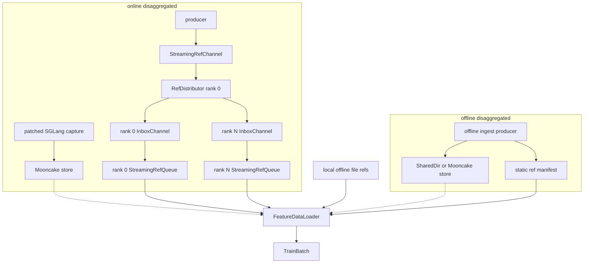

# Data plane design

The data plane owns feature storage, cross-process reference transport, and the
single bridge from `SampleRef` metadata to tensor-carrying `TrainBatch` objects.
See [`../ARCHITECTURE.md`](../ARCHITECTURE.md) for the complete topology.

## Invariants

- `SampleRef` transport is metadata-only; tensors never travel through the
  controller, SQLite ledger, manifest, or JSONL channels.
- `FeatureStore` is the only owner of captured feature tensors.
- `FeatureDataLoader` resolves refs through a store, validates and collates the
  result, and yields the only tensor-carrying runtime contract, `TrainBatch`.
- Offline refs are fixed and re-iterable. Online refs are consume-once and are
  never replayed as a second consumer epoch; resume rebuilds or reconciles only
  the untrained suffix.
- Independent fanout keeps one fixed source-index inventory, bounds both live
  refs and live bytes, and never requires consumers to advance in lockstep.

## Topology map



The online-disaggregated path is always
`RefDistributor -> per-rank InboxChannel -> StreamingRefQueue`, even when the
consumer has one rank. A trainer never reads the producer's source channel
directly.

## Stores

### `FeatureStore` and `LocalFeatureStore`

[`feature_store.py`](feature_store.py) defines storage lifecycle operations:
`put`, `get`, `release`, `abort`, and `gc`. `LocalFeatureStore` supports
`file://` samples for colocated offline training. Its in-memory mode remains a
useful test utility but is not a canonical online topology.

`get` returns tensors plus a lease handle. The loader clones when required and
then releases the handle. Offline file refs remain available for later epochs.

`abort` removes failed or abandoned samples. Optional resident-byte limits and
`gc` bound leaks from stranded online objects.

### Cross-process stores

[`disaggregated.py`](disaggregated.py) provides the shared-directory backend
used by offline examples. [`mooncake_store.py`](mooncake_store.py) provides the
Mooncake backend used by online disaggregation and optionally by offline
ingestion. Both implement the same `FeatureStore` contract, so the trainer and
loader are transport-agnostic.

## Reference sources

### Offline fixed refs

[`offline_reader.py`](offline_reader.py) points at precomputed local feature
files. For disaggregation, [`disagg_ingest.py`](disagg_ingest.py) publishes
existing feature tensors into the selected store and writes one immutable
manifest. The consumer waits for the producer's completion sentinel and loads
that fixed ref list.

Both paths feed `FeatureDataLoader` in refs mode. They support multiple epochs
and an offline checkpoint can seek the next iteration to its saved sample
position.

### Online-disaggregated source channel

[`streaming_ref_channel.py`](streaming_ref_channel.py) is the append-only,
filesystem-backed metadata channel between producer and consumer pools. It
publishes explicit closed, producer-failed, consumer-done, and consumer-failed
sidecars. Its consumed counter is the producer's remote backpressure signal.

The producer writes refs directly to this channel. It has no local training
queue and no training ledger. Tensors are already in Mooncake and never enter
the channel.

### `RefDistributor`, inboxes, and `StreamingRefQueue`

[`ref_distributor.py`](ref_distributor.py) runs once on consumer rank 0. It is
the sole source-channel reader and the sole process that commits refs to the
fresh durable ledger. It groups refs into

```text
quantum = dp_size * batch_size * accumulation_steps
```

and round-robins each complete quantum into one private `InboxChannel` per
rank. Each rank receives exactly `batch_size * accumulation_steps` refs, enough
for one lockstep optimizer step. The inbox is adapted to the loader's queue
protocol by `StreamingRefQueue`.

After the loader consumes a micro-batch, `StreamingRefQueue.ack` advances that
inbox's consumed counter. The distributor sums rank counters and advances the
source-channel counter; dispatch alone does not make a ref consumed. Durable
optimizer ack is handled separately by `DPAckController`.

Before producer capture, consumer rank 0 publishes `quantum` on the source
channel. The producer's in-flight high watermark must be at least that value;
`DISAGG_IN_FLIGHT_HIGH_WATERMARK` defaults to `256` in the canonical CLI.

If source EOF arrives with fewer than one full quantum staged, the distributor
fails those refs non-retryably, adopts and aborts their feature-store objects,
settles the source counter, and closes every inbox after the aligned prefix.
Cleanup errors remain loud and poison all inboxes. Ranks never train a partial
global optimizer window.

Those terminal tail ids remain committed-but-unacknowledged in the attempt's
metadata ledger after their feature objects are removed. Do not reuse a
successfully completed ledger containing such a tail for resume; a later
control-plane terminal-drop state is required before that can be supported.

## `FeatureDataLoader`

[`feature_dataloader.py`](feature_dataloader.py) has two input modes:

- `refs`: a fixed, re-iterable offline list;
- `queue`: a rank's consume-once online `StreamingRefQueue`.

For every ref it performs `store.get -> clone if needed -> store.release`, then
applies the injected per-sample transform and collator. The loader contains no
model-specific loss logic and no topology branch.

Queue acknowledgement has two layers in online disaggregation. Materialization
only releases the feature read lease. At the optimizer boundary,
`DPAckController` gathers every rank's sample ids, rank 0 records one durable
ledger transaction, then every rank removes only its own shard through its own
feature-store client. A second cleanup-error collective completes before each
private inbox advances its exact acknowledged prefix. This ordering keeps
producer backpressure and restart accounting aligned with durable optimizer
progress.

### Windowed independent consumers

The original `windowed_capture` import is a compatibility facade over three
ownership-focused modules:

- `windowed_capture_contracts.py` defines capture keys, requests, leases,
  failures, and the canonical contract digest;
- `windowed_capture_registry.py` owns all SQLite transactions, generations,
  consumer cursors, interest accounting, reservations, and reclamation;
- `windowed_capture_queue.py` adapts one consumer cursor to the loader queue
  protocol.

`windowed_capture_runtime.py` adds producer batching/retry and consumer
heartbeat control. A consumer registers before model loading so producer
startup does not mistake long CUDA/model initialization for a missing worker.
Its queue acquires refs in source order and advances the registry cursor only
after the optimizer-durable ACK reaches the queue.

The registry distinguishes soft window interest from hard demand/read interest.
It can evict a ready entry used only for lookahead, but cannot evict an acquired
lease. Capture slots and bytes are reserved in the same transaction that claims
work. A failed or reclaimed attempt fences its generation, so a delayed capture
completion cannot publish stale payload metadata.

The producer is the Mooncake lifetime owner and drains every retained object on
success, failure, or signal unwind. Consumers create non-owner store clients and
may finish or fail independently; the registry removes only that consumer's
waiters, leases, and window interests.

## Attempt lifecycle

An online producer always claims a fresh attempt and cannot resume. A fresh
consumer also rejects a non-empty ledger. A consumer restart is supported only
when its SQLite ledger, original channel/inboxes, Mooncake objects, and matching
checkpoint remain available: rank 0 skips the optimizer-durable prefix and
requeues the unacknowledged tail. For an acked remote-rank ref, the fresh
authority first adopts its durable key metadata before deleting it. A second
pass over consumed refs remains unsupported. Producer/consumer failures are
propagated explicitly, and both roles run a bounded pending-remove drain that
fails loudly instead of hiding a hard-pinned Mooncake leak.

Offline manifests and feature objects are intentionally stable instead. They
remain available for repeated epochs and checkpoint resume.
