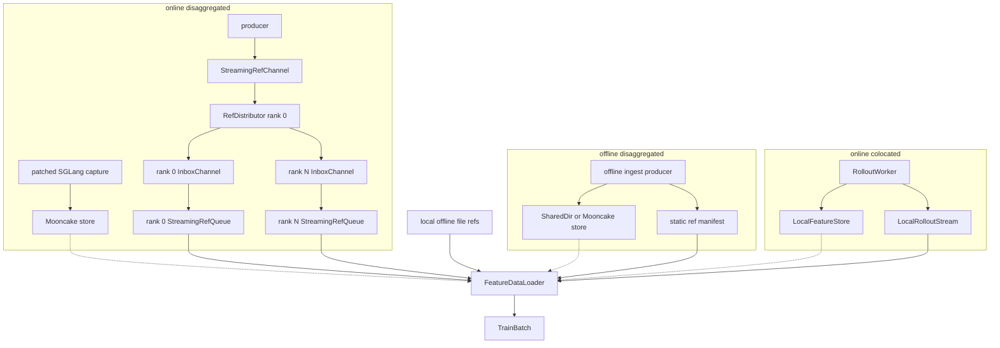

# Data plane design

The data plane owns feature storage, cross-process reference transport, and the
single bridge from `SampleRef` metadata to tensor-carrying `TrainBatch` objects.
See [`../ARCHITECTURE.md`](../ARCHITECTURE.md) for the complete topology.

## Invariants

- `SampleRef` transport is metadata-only; tensors never travel through the
  controller, SQLite ledger, manifest, or JSONL channels.
- `FeatureStore` is the only owner of captured feature tensors.
- `FeatureDataLoader` resolves refs through a store, validates and collates the
  result, and yields the only tensor-carrying runtime contract, `TrainBatch`.
- Offline refs are fixed and re-iterable. Online refs are consume-once and are
  never replayed for resume or a second consumer epoch.

## Topology map



The online-disaggregated path is always
`RefDistributor -> per-rank InboxChannel -> StreamingRefQueue`, even when the
consumer has one rank. A trainer never reads the producer's source channel
directly.

## Stores

### `FeatureStore` and `LocalFeatureStore`

[`feature_store.py`](feature_store.py) defines storage lifecycle operations:
`put`, `get`, `release`, `abort`, and `gc`. `LocalFeatureStore` supports
in-memory `mem://` samples for colocated online capture and `file://` samples
for colocated offline training.

`get` returns tensors plus a lease handle. The loader clones when required and
then releases the handle. Online in-memory samples are consume-once and free on
their last current-generation release. Offline file refs never become a
consume-once in-memory stream and remain available for later epochs.

`abort` removes failed or abandoned samples. Optional resident-byte limits and
`gc` bound leaks from stranded online objects.

### Cross-process stores

[`disaggregated.py`](disaggregated.py) provides the shared-directory backend
used by offline examples. [`mooncake_store.py`](mooncake_store.py) provides the
Mooncake backend used by online disaggregation and optionally by offline
ingestion. Both implement the same `FeatureStore` contract, so the trainer and
loader are transport-agnostic.

## Reference sources

### Offline fixed refs

[`offline_reader.py`](offline_reader.py) points at precomputed local feature
files. For disaggregation, [`disagg_ingest.py`](disagg_ingest.py) publishes
existing feature tensors into the selected store and writes one immutable
manifest. The consumer waits for the producer's completion sentinel and loads
that fixed ref list.

Both paths feed `FeatureDataLoader` in refs mode. They support multiple epochs
and an offline checkpoint can seek the next iteration to its saved sample
position.

### Colocated online pull-through

[`local_rollout_stream.py`](local_rollout_stream.py) implements a bounded queue
facade over the controller's private local queue. When the loader requests a
batch, the stream runs only enough rollout work to fill it. This bounds local
feature residency and keeps target inference on the training thread.

### Online-disaggregated source channel

[`streaming_ref_channel.py`](streaming_ref_channel.py) is the append-only,
filesystem-backed metadata channel between producer and consumer pools. It
publishes explicit closed, producer-failed, consumer-done, and consumer-failed
sidecars. Its consumed counter is the producer's remote backpressure signal.

The producer writes refs directly to this channel. It has no local training
queue and no training ledger. Tensors are already in Mooncake and never enter
the channel.

### `RefDistributor`, inboxes, and `StreamingRefQueue`

[`ref_distributor.py`](ref_distributor.py) runs once on consumer rank 0. It is
the sole source-channel reader and the sole process that commits refs to the
fresh durable ledger. It groups refs into

```text
quantum = dp_size * batch_size * accumulation_steps
```

and round-robins each complete quantum into one private `InboxChannel` per
rank. Each rank receives exactly `batch_size * accumulation_steps` refs, enough
for one lockstep optimizer step. The inbox is adapted to the loader's queue
protocol by `StreamingRefQueue`.

After the loader consumes a micro-batch, `StreamingRefQueue.ack` advances that
inbox's consumed counter. The distributor sums rank counters and advances the
source-channel counter; dispatch alone does not make a ref consumed. Durable
optimizer ack is handled separately by `DPAckController`.

Before producer capture, consumer rank 0 publishes `quantum` on the source
channel. The producer's in-flight high watermark must be at least that value;
`DISAGG_IN_FLIGHT_HIGH_WATERMARK` defaults to `256` in the canonical CLI.

If source EOF arrives with fewer than one full quantum staged, the distributor
fails those refs non-retryably, aborts their feature-store objects best-effort,
settles the source counter, and poisons all inboxes with a failure sentinel.
Ranks never train or silently drop a partial global optimizer window.

## `FeatureDataLoader`

[`feature_dataloader.py`](feature_dataloader.py) has two input modes:

- `refs`: a fixed, re-iterable offline list;
- `queue`: a consume-once online source (`LocalRolloutStream` or a rank's
  `StreamingRefQueue`).

For every ref it performs `store.get -> clone if needed -> store.release`, then
applies the injected per-sample transform and collator. The loader contains no
model-specific loss logic and no topology branch.

Queue acknowledgement has two layers in online disaggregation. The loader
acks the private inbox after materializing each micro-batch, which drives
producer backpressure. At the optimizer boundary, `DPAckController` gathers all
rank sample ids and rank 0 records one durable ledger transaction.

## Attempt lifecycle

Online control and tensor objects belong to one fresh attempt. The public
launcher requires fresh channel and SQLite paths; rank 0 recreates ephemeral
inboxes. Online resume and a second pass over consumed refs are unsupported.
Producer/consumer failures are propagated explicitly, and the producer cleans
published Mooncake objects when the attempt finishes.

Offline manifests and feature objects are intentionally stable instead. They
remain available for repeated epochs and checkpoint resume.
