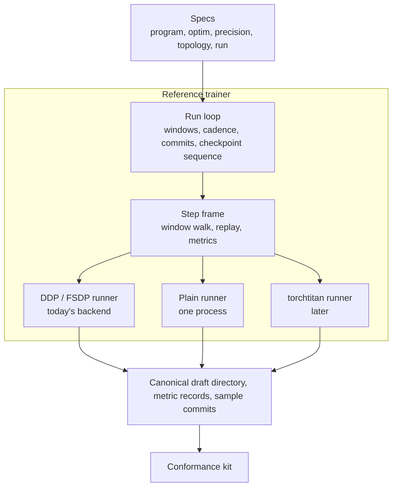

# Training backends: program, step runner, trainer (`specforge.training`)

**Status: proposal, fourth revision.** Nothing in this note is implemented and nothing in it was
run. The design that runs today is [`DESIGN.md`](DESIGN.md); the cross-plane picture is
[`../runtime/ARCHITECTURE.md`](../runtime/ARCHITECTURE.md). Symbols cited as "today" were read on
`main` at `c0f0a39c`. The section [Decisions for maintainers](#decisions-for-maintainers) lists the
choices this note does not make.

## Goals

1. **Attach an external training engine** (first: [torchtitan](https://github.com/pytorch/torchtitan))
   without changing an objective, a draft definition or the data path.
2. **Allow a trainer dedicated to draft training**, accepted on evidence rather than on review of
   its internals.
3. **Keep the API small and closed**: a few value types and protocols, each with one owner and a
   conformance test.

Out of scope: fault tolerance, a run controller, changes to capture or transport, and how a loss
is executed inside a program (chunking, fused kernels).

**Not yet shown.** No measurement in the repository shows that the step mechanics, rather than the
data path, bound training throughput, and no gain has been attributed to torchtitan for a small
trainable draft beside large frozen tables. The first deliverable of this work is that
measurement; see [Delivery](#delivery).

Throughput is one of two motives for the first goal. The other is coverage: the hardware and model
features an external engine maintains. The measurement settles the first motive only. Whether
coverage alone justifies the work, and whether such an engine is meant to become the default, is
[decision 9](#decisions-for-maintainers).

## What the design starts from

| # | Statement | Kind |
|---|---|---|
| 1 | The target is frozen and only prefills. A captured feature depends on target weights and tokens, not on the draft. There is no weight sync and no staleness, and recorded features can be replayed into any trainer | workload |
| 2 | Target execution belongs to the inference plane ([`../inference/DESIGN.md`](../inference/DESIGN.md#ownership-of-target-execution)). A trainer never runs target layers | decision |
| 3 | The loss denominator is not known before the forward: anchors are sampled inside the objective and some weightings depend on the draft's own predictions. An update is therefore normalised after the backward | consequence of how today's objectives sample; a backend cannot assume otherwise |
| 4 | The unit a backend can treat uniformly is a program: `program(tensors, ctx) -> ObjectiveResult`. An objective may drive the draft several times per batch (the EAGLE3 rollout, the DSpine two-pass window) and may or may not materialize full logits. A backend cannot assume logits exist | workload |
| 5 | The frozen target tables are large and are never sharded or optimized; the trainable draft is a few layers. Today the default wraps the draft with FSDP `SHARD_GRAD_OP` (`training.fsdp_sharding`); `NO_SHARD` selects DDP | fact about today |
| 6 | The artifact is the product: a canonical draft directory goes to export and to SGLang. Which trainer produced it must not show | decision |
| 7 | Canonical training is data-parallel only: trainer tensor- and sequence-parallel sizes must be one (`training/canonical.py`), and no bundled recipe sets one above one. The repository also has code that communicates inside a forward: ring / Ulysses attention on the legacy EAGLE3 path (`modeling/draft/llama3_eagle.py`), and a tensor-parallel embedding and LM head (`layers/embedding.py`, `lm_head.py`) that no training path constructs | fact about today |

## Process model

This is fixed outside the training plane and a backend must fit inside it.

- **Ranks are launched before any trainer code runs**, by the launcher (`torchrun`). Training is
  SPMD: every protocol method below runs on every rank, in the same order.
- **The world is initialized once**, in `specforge.cli`: `init_distributed` creates the process
  groups, including the tensor- and sequence-parallel ones, and keeps them as module state in
  `specforge.distributed`; `set_seed(training.seed)` seeds every rank with the same seed. The data
  plane then creates its own groups in a fixed order (`runtime/control_plane/dp_ack.py`).
- **A runner derives what it needs from that world.** It does not initialize or destroy it, does
  not create groups in a rank-dependent order, does not re-seed, and does not change process-wide
  torch state without declaring it. It is the only part that hands a process group to a component
  (see [Two axes of communication](#two-axes-of-communication)).
- **Groups are created in one order, before the first batch.** Today that is the world and its
  meshes in `specforge.cli`, then the data plane's acknowledgement group where a run uses one
  (`build_disagg_online_consumer`), then the trainer. `runner.prepare` takes the trainer's place:
  a runner whose engine creates groups does so there, on every rank in the same order, and nothing
  creates a group after `prepare` returns. The composition root owns the order.
- **The launcher owns process lifetime.** A trainer that starts helper processes owns their death.

torchtitan's `TrainingEngine` constructor binds the device, applies NUMA binding, seeds RNG, sets
process-group timeouts and calls its own `init_distributed`, which returns early when the world is
already initialized. An adapter has to make each of those either a no-op or the single owner; see
[Attaching torchtitan](#attaching-torchtitan).

## Today

`Trainer -> TrainerController -> TrainerCore -> DraftTrainStrategy -> FSDPTrainingBackend`
([`DESIGN.md`](DESIGN.md)). A `TrainingBackend` ABC exists and has one implementation. What keeps
a second one out:

| Coupling | Where |
|---|---|
| The model tells the backend what it needs through attributes set after construction | `build_bundle` sets `frozen_target_modules` and `fsdp_param_dtype`; `FSDPTrainingBackend` reads them and `_no_split_modules` with `getattr` |
| Collectives are issued outside the backend | `objectives.base.microbatch_mean`, the window replay in `CanonicalTrainStrategy`, `TrainerCore._normalize_gradients`, `BF16Optimizer`, the evaluator, `CheckpointManager` |
| The step core rescales gradients assuming the wrapper averages across ranks | `TrainerCore._normalize_gradients` multiplies by world size |
| Structure, weights, target tables and kernels are built in one call | `training.canonical.build_bundle` |
| A checkpoint mixes the draft weights with the backend's state | `training_state.pt` holds the draft weights, the loop counters and, under DDP, the optimizer; `training_state_rank{r}.pt` holds FSDP optimizer state and every rank's RNG |
| Process groups are process-global | `specforge.distributed` holds the meshes and groups; layers, data utilities, the batch partition and the trainer read them through getters |
| Precision is decided in three places | `model.torch_dtype` becomes the `fsdp_param_dtype` attribute; the wrapper sets `MixedPrecision(param_dtype=..., buffer_dtype=float32)` and no `reduce_dtype`, so gradients are reduced in the parameter dtype; `BF16Optimizer` keeps fp32 master copies |

Each side has one fixed producer as well: `Trainer.__init__` constructs `FSDPTrainingBackend`, and
`training.assembly` constructs `BF16Optimizer`.

## The contract

Two levels. The first is specified here; the second is introduced only together with its first
real implementation (see [A dedicated trainer](#a-dedicated-trainer)).


```mermaid
flowchart TB
  SPEC["Specs<br/>program, optim, precision, topology, run"]
  subgraph REF["Reference trainer"]
    direction TB
    LOOP["Run loop<br/>windows, cadence, commits, checkpoint sequence"]
    FRAME["Step frame<br/>window walk, replay, metrics"]
    LOOP --> FRAME
    FRAME --> FSDP["DDP / FSDP runner<br/>today's backend"]
    FRAME --> PLAIN["Plain runner<br/>one process"]
    FRAME --> TITAN["torchtitan runner<br/>later"]
  end
  ART["Canonical draft directory, metric records, sample commits"]
  KIT["Conformance kit"]
  SPEC --> LOOP
  FSDP --> ART
  PLAIN --> ART
  TITAN --> ART
  ART --> KIT
```

```python
# training/contracts.py: value types and protocols only

@dataclass(frozen=True)
class ProgramSpec:                               # pure data; recorded; available without building a model
    draft: DraftConfig
    objective: ObjectiveSelection                # objective, loss, weighting, options
    kernels: Kernels                             # every implementation choice, resolved at startup
    requires: DataRequirements                   # features, capture layers, batch constraint, host inputs, sample cost
    reduction: Literal["window", "microbatch"]   # how the loss is normalised; see "Reductions"
    statistics: tuple[StatisticSpec, ...]        # name and delivery point of each declared statistic
    partition: PartitionHints                    # indivisible blocks; tensors pinned to their own dtype
    axes: Mapping[str, Literal["copy", "part", "own"]]   # model-parallel axes it communicates on; empty today

class TrainingProgram(Protocol):                 # today's ObjectiveModel
    draft: nn.Module                             # trainable; its state dict is the artifact, under canonical keys
    frozen: tuple[nn.Module, ...]                # target tables, teacher head: never sharded or optimized
    def forward(self, tensors: Mapping[str, Tensor], ctx: StepContext) -> ObjectiveResult: ...
    def apply_statistic(self, name: str, value: Tensor) -> None: ...   # no collective; same on every rank

class ProgramFactory(Protocol):
    spec: ProgramSpec
    def build(self, *, device, precision: PrecisionSpec,
              groups: Mapping[str, ProcessGroup]) -> TrainingProgram   # structure only; draws no random numbers
    def initial_state(self, *, device,
                      precision: PrecisionSpec) -> Iterator[tuple[str, Tensor]]   # canonical keys, full tensors

@dataclass(frozen=True)
class StepContext:                               # values only; no callables, no process groups
    step: int
    total_steps: int
    replay_values: Mapping[str, Tensor]          # pooled `replay` statistics by name; empty outside a replay

class StepRunner(Protocol):
    @classmethod
    def supports(cls, spec: ProgramSpec, optim: OptimSpec, precision: PrecisionSpec,
                 topology: Topology, run: RunSpec) -> Supported | Unsupported: ...
    def prepare(self, factory: ProgramFactory, optim: OptimSpec, precision: PrecisionSpec,
                topology: Topology, run: RunSpec) -> None: ...
    def forward_backward(self, window: Sequence[TrainBatch], ctx: StepContext) -> PendingStep: ...
    def apply_step(self, pending: PendingStep) -> StepMetrics: ...    # consumes the handle
    def prepass(self, batch: TrainBatch, ctx: StepContext) -> ObjectiveResult: ...   # training mode, no gradients
    def evaluate(self, batch: TrainBatch, ctx: StepContext) -> ObjectiveResult: ...  # eval mode, no gradients
    def reduce_sum(self, values: Tensor) -> Tensor: ...
    def agree(self, error: str | None) -> None: ...                   # raises on every rank if any rank reported an error
    def draft_state(self) -> dict[str, Tensor]: ...                   # full on rank 0, empty elsewhere
    def save_resume(self, out: Path) -> None: ...
    def load_resume(self, src: Path) -> None: ...
    def close(self) -> None: ...
```

### Resolved values

The composition root (`application`) resolves these once, before any model is built, and compares
them across ranks. Every checkpoint's run record carries them. A runner honours every field or
refuses in `supports()`. It never substitutes a value. Everything `supports()` decides on is in
these values and in `ProgramSpec`, so the verdict needs no model.

| Value | Holds | Today |
|---|---|---|
| `Kernels` | every implementation choice that leaves the math alone but may move rounding or memory: attention backend, loss execution (chunking, checkpointing, fused kernels), component kernels | `training.attention_backend`, `model.use_liger_kernel`, the objective's chunk size; on the legacy path also `fused_logits_loss`, `objective_chunk_blocks`, `objective_checkpointing` |
| `PrecisionSpec` | five dtypes: `parameter` (as stored), `compute` (the forward), `reduce` (gradient communication), `master` (optimizer copies, or none), `buffer` (a cast applied by the wrapper, or none) | bf16, bf16, bf16, fp32 for the default `model.torch_dtype`; buffers are cast to fp32 under FSDP and left as built under DDP. See the last row of the table in [Today](#today) |
| `Topology` | `world_size`; for the data-parallel axis and each model-parallel axis, its size and the group index of every rank | the arguments of `init_distributed` and the two meshes it builds in rank order, read back through getters |
| `OptimSpec` | learning rate, schedule and warmup, total steps, clip norm, master-weight placement | `training.*`; `BF16Optimizer` |
| `RunSpec` | accumulation window, horizon, seed, cadences | `training.*` |

- **A kernel that cannot run is an error, never a fallback.** Because `Kernels` is compared across
  ranks at startup, no forward needs a collective to agree on which kernel ran.
- **An implementation variant of a component is a kernel.** It is registered next to the component
  and selected through `Kernels`, and it carries a parity test against the reference
  implementation. If it stores parameters differently (fused, or split along a model-parallel
  axis), it converts to and from canonical keys in its own state-dict load and save, exactly, both
  ways. In this design a runner does not bring its own implementation of a component; whether that
  can hold for an engine with its own module protocol is decision 11.
- **No dtype is inferred.** A parameter or buffer that keeps a dtype of its own (an fp32 buffer
  inside a bf16 draft) is pinned by its component through `PartitionHints`, and a runner that
  cannot keep a pin refuses.
- **`Topology` replaces reads of process-global state** by the data plane (which ranks share a
  batch, who acknowledges), the frame and the runner. A runner asserts in `prepare` that the groups
  it uses, whether created at startup or by its engine, match the value.

The remaining names: `DataRequirements` is the union of what the draft, the objective and the loss
need from the data plane. `StatisticSpec` is a name and a delivery point. `PendingStep` is the
single-use handle from `forward_backward`: the window's reduced denominators, metric sums and
statistic sums. `StepMetrics` is the reduced loss, the reduced metric pairs, the pre-clip gradient
norm, the learning rate applied and the pooled `after_step` statistics. `Supported` carries the
numerics class; `Unsupported` carries the reason.

### Reductions

`ObjectiveResult` carries the loss, metric pairs and the local sums of the program's declared
statistics. `ProgramSpec.reduction` declares one **reduction** for the program:

| Reduction | The program returns | The update's objective over a window of `A` micro-batches and the data-parallel ranks | Who reduces |
|---|---|---|---|
| `window` (default) | one numerator, the coefficient-weighted sum of its terms, and **one** denominator | `sum(numerator) / sum(denominator)`, both sums over every micro-batch and rank | the runner, once, after the last backward |
| `microbatch` | terms `(coefficient, numerator, denominator)`, each with its own denominator | the mean over the `A` micro-batches of `sum_t c_t * (sum over ranks of numerator_t) / (sum over ranks of denominator_t)` | the runner, per micro-batch, between that micro-batch's forward and backward, in one reduction for all terms |

**One denominator per window.** Under `window` the gradient is accumulated first and rescaled once,
so it can carry one denominator only. An objective whose terms need different denominators has
three choices, made when it is resolved and never at run time: declare `microbatch`; normalise each
term locally and return a denominator of one (the mean of local losses); or be refused, with the
terms named. Several terms that share one denominator need none of this and stay under `window`:
that is every multi-term canonical objective today (DFlash2, Domino, DSpine) except DSpark's, which
is `microbatch`. The three reductions in `objectives/execution.py` map onto these: `tokens` is
`window`; `sum_means` is `window` with locally normalised terms and a denominator of one, except
under D-PACE weighting, where it keeps a pooled denominator like `tokens`; `global_microbatch` is
`microbatch`.

The program never issues a collective across samples and never needs the data-parallel size. The
two reductions are what `TrainerCore` and `microbatch_mean` compute today in exact arithmetic for
every canonical objective. Under `window`, each numerator is divided by the accumulation count, the
wrapper averages over ranks, and the gradients are rescaled by world size x accumulation / global
denominator. Under `microbatch`, the denominator is reduced before the backward and the later
rescale is by one. How a runner gets there (averaging or summing across ranks, where it divides) is
its own business. The formula does not fix rounding: see [Numerics classes](#numerics-classes).

### Step statistics

A program may declare statistics in `ProgramSpec.statistics`: sums that must be pooled over the
window and the data-parallel ranks before the program can use them. The program returns its local
sums in `ObjectiveResult`, the runner reduces them, and the pooled sums come back unchanged, as
values. Any arithmetic on them, such as a ratio and its zero guard, is the program's. No process
group reaches the program.

| Delivery | The pooled sums come back | Today |
|---|---|---|
| `replay` | through `ctx.replay_values`, to a second pass over the same window. The frame calls `prepass` for each micro-batch, pools the sums with `reduce_sum`, then calls `forward_backward` with the values. The runner remembers the RNG state each `prepass` started from and restores it before that micro-batch's replayed forward | the DSpine window statistic (`WindowStatistic`, `CanonicalTrainStrategy`), where the strategy also forms the ratio |
| `after_step` | through `program.apply_statistic(name, value)`, which the runner calls on every rank inside `apply_step`, after the optimizer update | nothing on `main`; the intended use is updating a draft buffer from pooled counts |

`apply_statistic` issues no collective and computes the same result on every rank, so the draft
stays identical across ranks. A buffer it writes belongs to the draft: it is in the artifact and in
the resume state, and `draft_state()` sees it because the call sits inside `apply_step`.

Not covered: a loss term that needs a value pooled from the same forward before that forward's
backward. It can be written as `replay`, at the cost of a second forward. A cheaper form, finishing
a deferred term between forward and backward, would be a new member of the contract and is added
with the first objective on `main` that needs it (see [API rules](#api-rules)).

### Two axes of communication

A rank belongs to one data-parallel group and, when a job declares them, to model-parallel groups.

| Axis | Ranks hold | Communication | Issued by |
|---|---|---|---|
| Data-parallel | different samples | gradient synchronisation, loss denominators, metrics, step statistics, agreement, checkpoint collectives | the runner, and nothing else in the training plane. The data plane keeps its acknowledgement collectives on its own groups |
| Model-parallel (tensor, sequence, expert) | parts of one sample, or parts of one parameter | inside a component's forward: the partial sums of a tensor-parallel layer, the key and value exchange of ring attention, the all-to-all of Ulysses attention, the token dispatch of expert parallelism | the component, on a group the runner passed to `build` |

Model-parallel communication is part of a component's math, so it stays inside the program. It is
legal under four conditions:

- **Declared.** `ProgramSpec.axes` names every axis the program communicates on, and `Topology`
  gives its size and layout. An axis larger than one that the program does not declare, or a
  declared axis the runner cannot provide, is refused in `supports()`.
- **Bound, not fetched.** The group arrives through `ProgramFactory.build(groups=...)`, which has a
  key for every declared axis, a group of one rank included. A missing key is an error: in
  `torch.distributed` an absent group silently means the whole world. A component never reads a
  process-global and never finds a group in an attribute set after construction.
- **Counted once.** `ProgramSpec.axes` gives each axis one of three kinds, and the runner's
  reduction and the data plane's dispatch follow from it:

  | Kind | Ranks of a group | A rank's returned sums | Example |
  |---|---|---|---|
  | `copy` | receive the same batch | are the whole; count one rank | tensor parallelism |
  | `part` | receive the same batch | are a shard; add them | sequence parallelism |
  | `own` | receive different batches | are their own samples; add them | expert parallelism, where only the parameters are split |

- **Same sequence.** Every rank of a group runs the same forwards in the same order.

A reduction over a model-parallel group that completes one sample's value, such as a per-sequence
statistic whose sequence is split across ranks, belongs to the component. A reduction across
samples never does.

Canonical training has no model-parallel axis today (statement 7), so `axes` is empty for every
bundled recipe, and these rules first bind the objective that adds one. Which axes are in scope is
[decision 10](#decisions-for-maintainers).

### Rank symmetry

Every method runs on every rank in the same order. Collectives and failure handling:

| Method | Collective | A rank-local failure |
|---|---|---|
| `supports` | no; pure, and the verdicts are compared across ranks at startup together with the resolved values | a disagreement stops the run before `prepare` |
| `prepare` | yes | raises on that rank before the first collective of the step path; the launcher tears the world down |
| `forward_backward` | yes in every multi-rank run: gradient synchronisation and the reductions; every rank receives the same number of batches | raises on that rank and the launcher tears the world down; a failure inside a step is not agreed, as today |
| `prepass`, `evaluate` | yes under sharding or with a model-parallel axis; every rank receives the same number of batches | as for `forward_backward` |
| `reduce_sum`, `apply_step` | yes | a check on a reduced value reaches the same verdict on every rank, so all ranks raise together; any other failure raises on that rank and the launcher tears the world down |
| `draft_state`, `save_resume`, `load_resume` | yes | reported through `agree`, never raised between two collectives |
| `agree` | yes: one gather of error strings | raises the combined error on every rank |
| `close` | no | — |

`draft_state()` is legal only between `apply_step` and the next `forward_backward`.

**`agree` is never called inside a step.** It runs in the checkpoint sequence and after
`load_resume`, where `CheckpointManager._all_ok` runs today. A step adds no gather and no host
read: its checks (the loss denominator, a finite gradient norm) use values that are already
reduced, in the single host read `BF16Optimizer` makes today.

### What each part owns

| Part | Owns | Must not know |
|---|---|---|
| Composition root (`application`) | resolving the specs and the [resolved values](#resolved-values) once; comparing them across ranks; choosing the runner | anything a runner does after `prepare` |
| Program | supervision, the draft forward, loss terms, the declared reduction and statistics; model-parallel communication inside its components | the data-parallel size, the optimizer, how it is wrapped |
| Step frame | walking the window; for a `replay` statistic, the order of prepass, pooling and replay; pooling evaluation results through the runner | gradients, process groups, the optimizer, RNG |
| Step runner | wrapping and placing the program, and passing it its model-parallel groups; writing the initial state into it; backward; every collective across samples, the training metrics included; normalisation; clipping; the optimizer and LR schedule; `after_step` statistics; RNG, with the restore for a replay; its resume state | the loss math; where data comes from |
| Run loop | the horizon; windows and the incomplete tail; repositioning the stream on resume; logging and checkpoint cadence; evaluation data, cadence and best-checkpoint tracking; the checkpoint sequence; sample commits | `torch.distributed`; model internals |

`OptimSpec` is a frozen value with today's fields (learning rate, schedule and warmup, total steps,
clip norm, master-weight placement). A runner honours it or refuses in `supports()`. It grows a
field when a second optimizer needs one. Where master copies are placed is in `OptimSpec`; their
dtype is in `PrecisionSpec`.

The initial state is handed over the same way as every other fact: the factory yields full tensors
under canonical keys, the same for every runner and world size on a given device type and
`PrecisionSpec`, and the runner writes them into the program it placed. Storage has two owners.
Replication and sharding are the runner's, so a runner that shards before it initializes slices each
tensor itself. Tensors are yielded one at a time, so the transient cost on a rank is the largest
single parameter, not the draft. Fused or model-parallel storage is the component's, converted in
its own state-dict load and save. Both `initial_state` and `draft_state` therefore speak canonical
keys. All random draws happen in `initial_state`, on today's device and dtype and in today's order;
`build` draws none.

### Checkpoints

A checkpoint has three parts and one commit point.

| Part | Content | Written by | Read by |
|---|---|---|---|
| Resume state | everything needed to continue: every draft parameter and buffer as the runner stores them, optimizer and scheduler state, RNG | `runner.save_resume`, every rank | the same runner under the same `Topology` |
| Artifact | the canonical draft directory, under canonical keys: a view derived from the resume state at the draft's declared dtype | rank 0, from `runner.draft_state()` | export, SGLang conversion, `initialization.checkpoint`, the conformance kit |
| Run record | step, epoch, samples consumed, the resolved `Kernels`, `PrecisionSpec` and `Topology`, the per-key resume contract and model provenance compared today, runner name and version | rank 0, **last** | the run loop on resume |

Sequence, on every rank: flush sample commits up to this step → `draft_state()` → rank 0 writes the
artifact → `save_resume()` → `agree(errors)` → rank 0 writes the run record → rank 0 moves the
`latest` link. A checkpoint exists if and only if its run record exists. A checkpoint is never ahead
of its durable commit, as today (`TrainerController.save_checkpoint`), and online resume keeps
requiring the ledger marker to equal the checkpoint step.

The resume state is the truth for continuing; the artifact is derived. The step counter has one
owner, the run loop; a runner whose engine keeps its own counter takes it from the run record.
Resuming with a different runner, `Topology`, `Kernels` or `PrecisionSpec` is refused, naming both
values; starting from the artifact always works and restarts the optimizer.

### Numerics classes

`supports()` returns the class for this job, not a constant of the runner: the kernels a runner
executes depend on configuration.

- **`exact`**: bit-identical to the stored trajectory of the reference runner **for the same
  topology** (same runner family, `Topology`, `Kernels`, `PrecisionSpec`, device type and torch
  build). Bit-equality across
  wrappers or world sizes is not defined: DDP and FSDP divide gradients at different points, and a
  single process cannot reproduce several ranks drawing from the same seed.
- **`equivalent`**: a different numerical program for the same objective. It is a numerics change.
  It is held to two checks, both set from the reference and never by the candidate:
  1. *first update*: from the same weights and the same recorded window, the pre-clip gradient norm
     and the parameter update agree with the reference within a stated relative tolerance;
  2. *end to end*: the comparison in [Conformance](#conformance), with a band taken from repeats of
     the reference.
  An `equivalent` runner is never selected by default until both exist for its class of jobs.

The choice is made once at startup, logged, compared across ranks and carried in every checkpoint's
run record. Selecting a runner whose dependency is missing is an error; it never falls back to
another runner.

**The reference runner is a role.** The DDP / FSDP runner holds it today. It moves to another
runner only by a maintainer decision, after that runner has passed both `equivalent` checks and the
serving metric for the recipes concerned. The stored trajectories are then re-recorded under the new
reference runner, and `exact` is measured against them from that point. The "reference trainer"
below is a different thing: the repository's own run loop and frame, over whichever runner is
selected.

## The reference trainer

| Today | Becomes |
|---|---|
| `TrainerController` | the run loop |
| `TrainerCore` and `CanonicalTrainStrategy` | the step frame |
| `FSDPTrainingBackend`, with `BF16Optimizer` behind it | the DDP / FSDP runner; the reference |
| (none) | the plain runner: one process, no wrapper. New code; it takes the reference-runner role for CPU only after it is shown bit-identical to the DDP / FSDP runner at one rank |
| `build_bundle` | `ProgramFactory.build` and `initial_state`; the artifact keeps its writer in `specforge.checkpoint` |
| attributes set on the model after construction | declarations on `ProgramSpec` and the fields of `PrecisionSpec` |
| getters of `specforge.distributed` read by layers, data utilities and the trainer | `Topology` as a value; groups passed by the runner to `build` |
| `microbatch_mean` and the DSpine replay calling `torch.distributed` | the declared reductions and the frame's prepass |
| `CheckpointManager._all_ok` | `runner.agree` |

What the current backend provides implicitly, and a new runner must provide or refuse: `no_sync`
around forward and backward for DDP, backward only for FSDP; the loss-denominator check folded into
the optimizer's single host read; frozen target modules kept out of sharding and out of the state
dict; per-rank RNG and FSDP optimizer state; failing when the stream ends inside a window instead of
stepping unreduced gradients; gradient reduction in the parameter dtype, and fp32 buffers under
sharding.

## Attaching torchtitan

At the step-runner level, by wrapping its `TrainingEngine`, as
[miles](https://github.com/radixark/miles) does (`miles/backends/torchtitan_utils/`). This section
is a list of what an adapter has to solve, not a mapping that is known to work. Read from
torchtitan `main` at `a1f6dcd2`; miles pins the `v0.4.0` release, where several names differ.

**Choose first: the torchtitan revision and the torch build.** SpecForge pins `torch==2.14.1`.
miles runs torchtitan `v0.4.0` on torch 2.14 by patching `torch.distributed.fsdp` at import time,
and notes that the release targets torch 2.15. A comparison across torch builds is confounded, so
the reference has to be re-recorded on whichever build is chosen.

| Contract | torchtitan | What the adapter has to solve |
|---|---|---|
| `prepare` | `TrainingEngine.initialize`: `model_config.build()` on the meta device → `model.parallelize(...)` → `to_empty` → `init_weights` → optimizer → checkpointer | Every stateful child must implement torchtitan's `Module` protocol; `_parallelize` raises on a plain `nn.Module` that owns parameters or buffers. The adapter has to meet that protocol for any component generically; a second implementation per component is not part of this design unless decision 11 allows it. Parameters are sharded before `init_weights`, while `initial_state` yields full tensors under canonical keys, so the adapter slices each one for its shards; torchtitan's own route for initial weights is its checkpointer with a state-dict adapter. `Config` must provide `max_context_length`, `get_parameter_counts` and `build_flops_estimator` |
| Process model | the constructor binds the device, applies NUMA binding, seeds RNG and sets group timeouts | make each a no-op or the single owner |
| `forward_backward` | `engine.forward_backward` expects its micro-batch type, `global_loss_token_counts` before the forward, and `preprocess_inputs`; accelerator-graph capture is on by default and forbids host syncs and varying shapes | miles bypasses it and drives `model_parts`, `loss_fn` and `engine.loss` itself, with a stateful loss object. Either route depends on engine internals; say which |
| Reduction | stock FSDP2 divides; torchtitan turns the division off in each model's own FSDP setup (`apply_fsdp_to_decoder`, and the flux and Transformers-backend equivalents), not in the engine; deferring the reduction to the last micro-batch is opt-in | the adapter's own `_apply_fsdp` decides, and `apply_step` scales accordingly |
| `apply_step` | `engine.optim_step()`: clip, finite check by `torch._assert_async`, step, scheduler | scale the reduced gradients before it |
| `save_resume`, `load_resume` | its checkpointer saves on its own interval, model-only at the last step by default, rotates, and loads the newest step in its folder. It saves no RNG | drive it explicitly; add RNG; reconcile its step counter with the run record |
| `draft_state` | no engine call gathers a full state | gather; map names to canonical keys; cast to the artifact dtype |
| Precision | fp32 parameters with bf16 compute; under replication through autocast, under sharding through the FSDP cast; frozen parameters stored in bf16 | it cannot honour today's `PrecisionSpec` (bf16 parameters, fp32 masters) and refuses it; a job selects fp32 parameters with bf16 compute explicitly. That selection is a numerics change, which is why the runner is `equivalent` for today's recipes |
| Step statistics | an engine may update state of its own around the optimizer step | one owner per statistic: the adapter turns the engine's update off, or the runner refuses the program |
| `close` | `engine.close()` | call it |

miles's adapter is about 1,000 lines for the core and, beyond the table, needed shape buckets with
compile warm-up and a custom checkpoint manager.

## A dedicated trainer

A second level, `Trainer.fit(job)`, lets a trainer replace the run loop, the frame and the runner
together. Its types (`Trainer`, `TrainJob`) are **not** specified here: they are introduced with the
first trainer that needs them, so that the abstraction is drawn from two working implementations.

What is fixed now, because it comes from the other planes:

- It consumes the same per-rank stream of `TrainBatch` and never executes target layers.
- It runs inside the process model above.
- **It keeps the commit contract.** A sample is committed only after the update that consumed it
  has been applied on every rank; commits are issued by every rank in the same order; an incomplete
  window is never committed; commits are flushed before a checkpoint. Features may be deleted at
  commit, and each rank receives exactly its dispatched references per window.
- It produces the same three checkpoint parts with the same commit point.

## Conformance

- **Numerics, by replay.** Recorded feature streams in the offline feature format: small ones for
  CPU, one at recipe scale. Features do not depend on the draft, so one recording serves every
  runner. An `exact` runner reproduces the stored trajectory for its topology (loss sequence, final
  weights, optimizer state). An `equivalent` one passes the first-update check and the end-to-end
  band.
- **Protocol, by a fake stream.** A consume-once stream with a recording ledger checks what a
  recording cannot: commit order across ranks, no commit for an incomplete window, commits flushed
  before a checkpoint, the run record written last.
- **The kit must be able to fail.** Three mutations of the reference are part of it and each must be
  caught: gradients scaled by the world size, clipping skipped, the LR schedule shifted by one step.
- **One case per declaration, not per recipe.** A runner is exercised with one job for each thing it
  claims in `supports()`: each reduction, each statistic delivery, each model-parallel axis. A
  recipe is a combination of these, so new drafts and losses need no new runner tests.
- **End metric.** The repository's evaluator reports a teacher-forced proxy for acceptance length.
  Serving acceptance length, measured through SGLang, is the metric for a default change.

## API rules

| Rule | Enforced by |
|---|---|
| Parts meet only through `training/contracts.py`, `runtime/contracts.py` and `config.draft` | an import scan |
| Values cross, handles do not: no `getattr` on another part's object, no callable in a context, no process-global topology, no environment read below `application`. One handle crosses, in one direction: the process group of a declared model-parallel axis, from the runner to `build` | a lint with an allowlist that may only shrink |
| In the training plane, a collective across samples appears only in a runner | the import scan: a `torch.distributed` collective in program, frame or run-loop code needs an allowlist entry naming its model-parallel axis |
| A runner decides from declarations, never from an architecture or objective name | the import scan: a backend package imports neither the model registry nor the objective registry |
| Honour or refuse: `supports()` names the reason; verdicts are compared across ranks | a test per refusal; a per-field mutation test on the first update for each `OptimSpec` field a runner claims |
| A step cannot be applied twice or without a backward | `PendingStep` is single-use |
| A backend is one package under `training/backends/`, registered by name; core never imports it; a missing dependency is an error | the import scan; the CPU suite without the dependency |
| A contract gains a member only with a second implementation that needs it | review |

## Delivery

Prerequisites, both unmet at `c0f0a39c` and owned by the canonical-training migration: one step path
(the legacy strategies removed), and trajectories recorded through the CLI while the legacy path
exists, at every world size the bundled recipes use.

| # | Change | Kind | Gate |
|---|---|---|---|
| 0 | Measure where step time goes on one recipe per family: data wait, forward, loss, backward, optimizer | measurement | a table in this note; it settles the throughput argument for the remaining steps, and decision 9 settles the coverage argument |
| 1 | Declarations replace attributes set after construction; `DataRequirements` on the spec; `Kernels`, `PrecisionSpec` and `Topology` resolved once and compared across ranks; `build_bundle` split into `build` and `initial_state` | behaviour-preserving | stored trajectories unchanged |
| 2 | Step frame, run loop and `StepRunner` over today's backend: the DDP / FSDP runner only; declared reductions and statistics; `agree` | behaviour-preserving | stored trajectories, bitwise, per topology |
| 3 | Plain runner | new | bit-identical to the DDP / FSDP runner at one rank on CPU, or the difference explained |
| 4 | Checkpoint parts and commit point | on-disk change | a census of every reader of `training_state.pt`; a reader for existing run directories |
| 5 | `application` as the only composition root for training | behaviour-preserving | the import scan |
| 6 | Conformance kit: replay, fake stream, mutations | tests | the three mutations fail |
| 7 | A spike: one canonical draft built and stepped under torchtitan at the chosen revision and torch build | measurement | a go or no-go with the adapter's size and throughput, and whether one generic adapter meets its `Module` protocol |
| 8 | torchtitan runner | new, `equivalent` | the kit; serving acceptance length; throughput and memory |
| 9 | `Trainer` and `TrainJob`, with the first dedicated trainer | new | the kit; serving acceptance length |

Order: 0 first. 1 → 2 → 3. 4, 5 and 6 after 2. 7 before 8. 9 after 6.

The first change a user can see is step 4. Step 2 changes the shape of the public
`specforge.training.Trainer` only if maintainers choose so.

## Decisions for maintainers

| # | Decision | Why it is not made here |
|---|---|---|
| 1 | Whether the measured step cost justifies this work, and for which recipes | step 0 has not been run |
| 2 | The torchtitan revision and the torch build | a dependency and numerics choice; SpecForge and torchtitan target different torch versions |
| 3 | Accepting torchtitan as `equivalent`, the first-update tolerance, and who sets the end-to-end band | a numerics trade |
| 4 | The artifact's dtype rule: written at the draft's declared dtype, cast by the same rounding the reference uses when it copies masters to parameters | a precision decision; a runner with fp32 parameters would otherwise produce a different artifact |
| 5 | The run-directory layout in step 4, and whether existing directories get a reader or a documented break | a user-visible on-disk contract |
| 6 | The config field that selects a runner, its default, and its relation to `training.fsdp_sharding` | a user-visible key |
| 7 | Whether `specforge.training.Trainer` keeps its public shape | a public API |
| 8 | Whether a dedicated trainer is in scope now | no implementation exists |
| 9 | Whether an external engine is meant to become the default runner and take the reference role, with the DDP / FSDP runner retired | a strategy choice. It decides whether coverage alone justifies steps 7 and 8, whether the plain runner (step 3) is worth building, and how early decision 2 has to be taken |
| 10 | Which model-parallel axes canonical training supports | none today, and no bundled recipe uses one; each axis needs a declaration, a bound group and a data-plane rule |
| 11 | Whether a backend may carry its own implementation of a component when no generic adapter satisfies its engine | it multiplies implementations by backends, and each one needs its own parity evidence; step 7 supplies the facts |

## Prior art

- miles: one step frame over a four-method runner
  (`miles/backends/training_utils/torch_native/`), and torchtitan `v0.4.0` attached by wrapping its
  `TrainingEngine` (`miles/backends/torchtitan_utils/`). Taken from it: the optimizer behind the
  runner, one adapter package per backend, refusals asserted at init. Not taken: a loss defined on
  full logits, a normaliser computed before the backward, process-global parallel state, and a
  backend that owns the model definition.
- torchtitan: `trainer.py` (the loop) over `training_engine.py` (model build, parallelization,
  optimizer, checkpoint, forward-backward).
