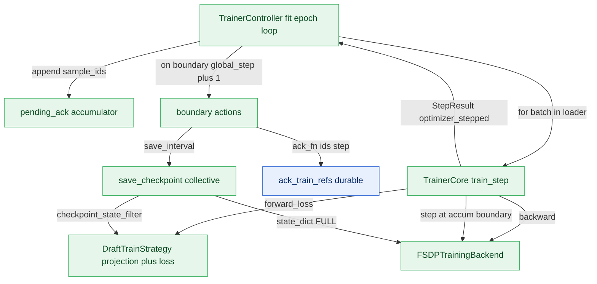

# Training Plane Design (`specforge.training`)

This is the design note for the **training**, scoped to this plane.
The cross-plane picture (whole-system map, endpoint reference, autonomy) lives in
[`../runtime/ARCHITECTURE.md`](../runtime/ARCHITECTURE.md); the shared records
every plane exchanges are in
[`../runtime/contracts.py`](../runtime/contracts.py).

## Responsibility

Owns the trainer-boundary split that turns a normalized, tensor-carrying TrainBatch into optimizer steps and checkpoints. Layered as: TrainerController (lifecycle: fit/save_checkpoint, epoch loop, optimizer-step counting, durable ack at grad-accum boundary) -> TrainerCore (exactly one branch-free train step + grad-accumulation/optimizer boundary) -> DraftTrainStrategy (per-draft-model required-feature validation, forward/loss, target projection ownership, checkpoint key filtering) and TrainingBackend (model wrap / no_sync-gated backward / optimizer step + distributed grad-norm reduction / full training state_dict). The plane is the ONLY tensor-carrying side besides the data plane (consumes TrainBatch.tensors). Strategy differs per draft model (EAGLE3 TTT vs DFlash block-parallel); controller/core/backend/checkpoint are shared unchanged. Submodules import SpecForge model code so they are imported explicitly by training entry points, not at specforge.runtime package load, keeping the control/data plane importable without a GPU. Checkpoint rotation and the latest pointer live in `specforge.training.checkpoint` and are imported lazily so the runtime seam stays leaf. Note: the module docstrings still reference a not-yet-implemented weight-publication / serving accept-length gate as future work; save_checkpoint persists the full resume state — the shared draft weights + counters (plus `dataset_size`/`accumulation_steps`, validated against the resuming run) on rank0 and each rank's OWN optimizer/RNG in per-rank files (they are shard-local under FSDP) — and returns a resume-target Checkpoint. Resume hands each rank its shard back as `read_resume_state(...)['backend']` and repositions the offline data stream (the persisted sample position -> `FeatureDataLoader.seek`), so a resumed epoch continues on the batches the interrupted run had not yet trained on.

## Internal mechanics

The training plane is the only tensor-carrying side besides the data plane; it consumes `TrainBatch.tensors`. `TrainerCore` executes exactly one branch-free step: `train_step` calls `strategy.forward_loss`, divides the loss by `accumulation_steps`, increments `self._micro`, decides the optimizer boundary (`self._micro % self.accumulation_steps == 0`), and calls `backend.backward(loss, is_boundary=...)` — the backend wraps the NON-boundary micro-steps in `no_sync()` (gradients accumulate locally) and lets the boundary backward run the FSDP reduction, so the reduction fires once per optimizer step, not once per micro-step. Only at the boundary does it call `backend.step()` for the grad-norm; `optimizer_stepped` in the returned `StepResult` is the single authoritative boundary signal, and `_scalar` ensures no live tensor leaks out. `TrainerController` owns the lifecycle: `global_step` counts optimizer steps only, and it maintains a `pending_ack` accumulator of `batch.sample_ids` that is flushed via `ack_fn(pending_ack, global_step)` as one durable transaction exactly at each boundary, then cleared. `fit` early-returns once `global_step` reaches `max_steps`, and the live epoch-position counter drives the epoch-start skip, so a re-entered `fit` never re-trains the epoch prefix. Training metrics use the configured logger channel without a second evaluation lifecycle. `save_checkpoint` delegates the on-disk layout, rotation, and latest pointer to `CheckpointManager`; there is one save site at each configured optimizer-step interval. The model-specific work lives in `DraftTrainStrategy`: `validate_batch` fail-fasts on missing `required_features`, and the strategy — not the core — owns the target projection (`Eagle3TrainStrategy._prepare_target` re-runs the frozen `TargetHead` for `target_repr=='hidden_state'`, computes the decayed per-position TTT loss) and `checkpoint_state_filter` (keep `draft_model.*`, strip prefix, drop `embed` only when the embedding params are frozen). `FSDPTrainingBackend` carries the parallel layout via `ParallelConfig.from_distributed` (handles snapshotted, never re-derived), FSDP-wraps with `use_orig_params=True`/bf16, performs the optimizer step plus a distributed L2 grad-norm all-reduce, and its `state_dict` is the full resume state `{model (FULL_STATE_DICT), optimizer (incl. scheduler), rng}` — the optimizer/RNG parts are rank-local (FSDP `use_orig_params` shard views), so `save_checkpoint` persists them per rank (`training_state_rank{r}.pt`) beside the rank0 shared payload, and `CheckpointManager.read_resume_state` hands each rank back its own via `state['backend']` (failing fast when full state is required but the rank's shard is missing or was written at another world size). It returns a resume-target `Checkpoint` — not a published weight version.

Natural end-of-stream is accepted only at an optimizer boundary. If the final
backward is inside FSDP `no_sync`, `fit` fails instead of stepping unreduced
gradients or reporting a checkpoint as successful. Queue-mode loaders likewise
fail a short terminal batch; fixed offline refs keep normal `drop_last`
semantics.

## Endpoints

### What this plane calls into

| From | Endpoint | Plane |
|---|---|---|
| `TrainerController` | `FeatureDataLoader.__iter__` | compute |
| `TrainerController` | `TrainerCore.train_step` | compute |
| `TrainerController` | `DataFlowController.ack_train_refs` | control |
| `TrainerCore` | `Eagle3TrainStrategy.forward_loss` | compute |
| `TrainerCore` | `FSDPTrainingBackend.backward` | compute |
| `TrainerCore` | `FSDPTrainingBackend.step` | compute |
