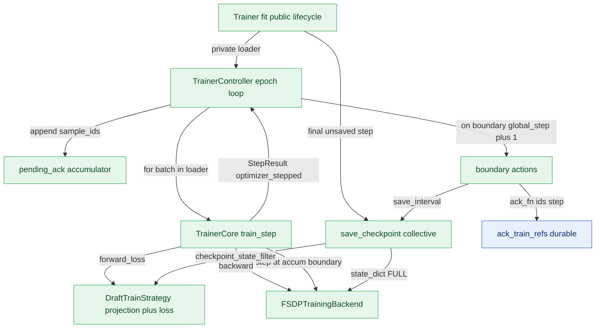

# Training Plane Design (`specforge.training`)

This is the design note for the **training**, scoped to this plane.
The cross-plane picture (whole-system map, endpoint reference, autonomy) lives in
[`../runtime/ARCHITECTURE.md`](../runtime/ARCHITECTURE.md); the shared records
every plane exchanges are in
[`../runtime/contracts.py`](../runtime/contracts.py).

## Responsibility

Owns the one caller-facing `Trainer` lifecycle that turns a normalized,
tensor-carrying `TrainBatch` stream into optimizer steps and checkpoints.
`Trainer.fit()` is the only package-level training call: it enters any
topology-owned stream context, invokes the internal `TrainerController` over its
private loader, exits the context, and writes the final checkpoint when the
last optimizer step was not already saved by the periodic checkpoint path.

Below that boundary, `TrainerController` owns the epoch loop, optimizer-step
counting, interval checkpoints, and durable acknowledgements;
`TrainerCore` owns one branch-free train step and the accumulation boundary;
`DraftTrainStrategy` owns model-specific validation, forward/loss, target
projection, and checkpoint filtering; `FSDPTrainingBackend` owns wrapping,
backward, optimizer steps, distributed gradient norms, and full training state.
Checkpoint rotation and the latest pointer live in
`specforge.training.checkpoint`. Resume restores each rank's optimizer/RNG
state and repositions fixed offline refs through `FeatureDataLoader.seek()`.

## Internal mechanics

The training plane is the only tensor-carrying side besides the data plane; it
consumes `TrainBatch.tensors`. `TrainerCore.train_step` divides the loss by
`accumulation_steps`, uses `no_sync()` only for non-boundary micro-batches, and
returns `optimizer_stepped` as the single authoritative boundary signal.
`TrainerController` increments `global_step` only at that boundary, commits the
pending sample acknowledgements, emits metrics, and performs configured
interval saves. The outer `Trainer` owns topology cleanup and the guarded final
save, so CLI, builders, and Python callers cannot select a second loader-based
training entry. All saves delegate to `CheckpointManager`; the shared draft
state is written by rank 0 while every rank writes its own optimizer/RNG state.

Natural end-of-stream is accepted only at an optimizer boundary. If the final
backward is inside FSDP `no_sync`, `fit` fails instead of stepping unreduced
gradients or reporting a checkpoint as successful. Queue-mode loaders likewise
fail a short terminal batch; fixed offline refs keep normal `drop_last`
semantics.

## Endpoints

### What this plane calls into

| From | Endpoint | Plane |
|---|---|---|
| `TrainerController` | `FeatureDataLoader.__iter__` | compute |
| `TrainerController` | `TrainerCore.train_step` | compute |
| `TrainerController` | `DataFlowController.ack_train_refs` | control |
| `TrainerCore` | `Eagle3TrainStrategy.forward_loss` | compute |
| `TrainerCore` | `FSDPTrainingBackend.backward` | compute |
| `TrainerCore` | `FSDPTrainingBackend.step` | compute |
